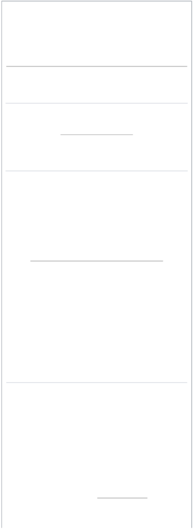
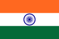
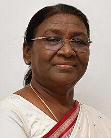
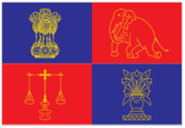
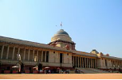
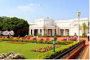
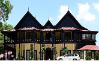
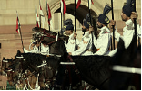

 

**President of India**

The  **president  of  India**  ([ISO](https://en.wikipedia.org/wiki/ISO_15919):  *Bhārata  kē/kī Rāṣṭrapati*)  is  the  [head  of  state](https://en.wikipedia.org/wiki/Head_of_state)  of  the  [Republic  of](https://en.wikipedia.org/wiki/Republic_of_India)

[India](https://en.wikipedia.org/wiki/Republic_of_India).  The  president  is  the  nominal  head  of  the executive,[\[a\]](#_page16_x26.25_y596.25) the first citizen of the country, as well as

the [supreme commander](https://en.wikipedia.org/wiki/Commander-in-chief) of the [Indian Armed Forces](https://en.wikipedia.org/wiki/Indian_Armed_Forces). [Droupadi Murmu](https://en.wikipedia.org/wiki/Droupadi_Murmu) is the 15th and current president, having taken office from 25 July 2022.

The  office  of  president  was  created  when  India became  a  republic  on  [26  January  1950](https://en.wikipedia.org/wiki/Republic_Day_\(India\))  when  [its constitution](https://en.wikipedia.org/wiki/Constitution_of_India)  came  into  force.  The  president  is [indirectly elected](https://en.wikipedia.org/wiki/Indirect_election) by an [electoral college](https://en.wikipedia.org/wiki/Electoral_College_\(India\)) comprising both  houses  of  the  [Parliament  of  India](https://en.wikipedia.org/wiki/Parliament_of_India)  and  the [legislative  assemblies](https://en.wikipedia.org/wiki/State_Legislative_Assembly_\(India\))  of  each  of  [India's  states  and territories](https://en.wikipedia.org/wiki/States_and_union_territories_of_India), who themselves are all [directly elected](https://en.wikipedia.org/wiki/Directly_elected) by the citizens.

[Article 53](https://en.wikisource.org/wiki/Constitution_of_India/Part_V#Article_53_{Executive_power_of_the_Union}) of the [Constitution of India](https://en.wikipedia.org/wiki/Constitution_of_India) states that the president  can  exercise  their  powers  directly  or  by subordinate  authority,  though  all  of  the  executive powers  vested  in  the  president  are,  in  practice, exercised by the [prime minister](https://en.wikipedia.org/wiki/Prime_Minister_of_India) heading the [Council of  Ministers](https://en.wikipedia.org/wiki/Union_Council_of_Ministers).[\[3\]](#_page17_x26.25_y225.75)  The  president  is  bound  by  the

constitution to act on the [advice](https://en.wikipedia.org/wiki/Advice_\(constitutional\)) of the council and to enforce  the  decrees  passed  by  the  [Supreme  Court ](https://en.wikipedia.org/wiki/Supreme_Court_of_India)under article 142.

**Origin![ref1]**

India achieved independence from the British on [15 August  1947](https://en.wikipedia.org/wiki/Independence_Day_\(India\)),  initially  as  a  [dominion](https://en.wikipedia.org/wiki/Dominion)  within  the [Commonwealth of Nations](https://en.wikipedia.org/wiki/Commonwealth_of_Nations) with [George VI](https://en.wikipedia.org/wiki/George_VI) as king, represented in the country by a [governor-general](https://en.wikipedia.org/wiki/Governor-General_of_India).[\[4\] ](#_page17_x26.25_y282.75)Following independence, the [Constituent Assembly of India](https://en.wikipedia.org/wiki/Constituent_Assembly_of_India),  under  the  leadership  of  [B.  R.  Ambedkar](https://en.wikipedia.org/wiki/B._R._Ambedkar), undertook the process of drafting a completely new constitution for the country. The [Constitution of India ](https://en.wikipedia.org/wiki/Constitution_of_India)was  eventually  enacted  on  26  November  1949  and came  into  force  on  26  January  1950,[\[5\]](#_page17_x26.25_y339.75): 26   making India  a  [republic](https://en.wikipedia.org/wiki/Republic).[\[6\]](#_page17_x26.25_y396.75): 9   The  offices  of  monarch  and

**President of India** *Bhārata kē/kī Rāṣṭrapati*

Logo of The President of India

[Flag of India](https://en.wikipedia.org/wiki/Flag_of_India)

**Incumbent
[Droupadi Murmu** ](https://en.wikipedia.org/wiki/Droupadi_Murmu)**since 25 July 2022

[Head of state of the Republic of India](https://en.wikipedia.org/wiki/Politics_of_India#President_of_India)
[Executive branch of the Indian Government](https://en.wikipedia.org/wiki/Government_of_India#Executive)

[**Style**](https://en.wikipedia.org/wiki/Style_\(form_of_address\)) Hon’ble President

(Within India)[\[1\]](#_page17_x26.25_y84.75)

Her Excellency

(Outside India)[\[1\]](#_page17_x26.25_y84.75)

The Honourable

(Within [Commonwealth)](https://en.wikipedia.org/wiki/Commonwealth_of_Nations)

**Type** [Head of state](https://en.wikipedia.org/wiki/Head_of_state)

governor-general were replaced by the new office of President of India, with [Rajendra Prasad](https://en.wikipedia.org/wiki/Rajendra_Prasad) as its first incumbent.[\[6\]](#_page17_x26.25_y396.75): 1   India  retained  its  Commonwealth membership per the [London Declaration](https://en.wikipedia.org/wiki/London_Declaration), recognising The King as "the symbol of the free association of its independent member nations and as such the Head of the Commonwealth."[\[7\]](#_page17_x26.25_y453.75)

The Indian constitution accords to the president the responsibility and authority to defend and protect the Constitution of India and its rule of law.[\[8\]](#_page17_x26.25_y510.75) Invariably, any  action  taken  by  the  executive  or  legislature entities of the constitution shall become law only after the president's assent. The president shall not accept any actions of the executive or legislature which are unconstitutional. The president is the foremost, most empowered and prompt defender of the constitution (Article 60), who has pre-emptive power for ensuring constitutionality  in  the  actions  of  the  executive  or legislature. The role of the judiciary in upholding the Constitution of India is the second line of defence in nullifying  any  unconstitutional  actions  of  the executive and legislative entities of the Indian Union.

[Commander-in-chief ](https://en.wikipedia.org/wiki/Commander-in-chief)**Abbreviation** POI

[**Residence** ](https://en.wikipedia.org/wiki/Official_residence)[Rashtrapati Bhavan](https://en.wikipedia.org/wiki/Rashtrapati_Bhavan)

[**Seat**](https://en.wikipedia.org/wiki/Seat_\(legal_entity\)) [New Delhi, Delhi, India ](https://en.wikipedia.org/wiki/New_Delhi,_Delhi,_India)**Appointer** [Electoral College of India ](https://en.wikipedia.org/wiki/Electoral_College_\(India\))[**Term length**](https://en.wikipedia.org/wiki/Term_of_office) Five years

No restriction on renewal

**Constituting** [Constitution of India (](https://en.wikipedia.org/wiki/Constitution_of_India)Article **instrument** 52)

**Precursor** [Monarch of India a](https://en.wikipedia.org/wiki/List_of_heads_of_state_of_India#Monarch_of_India_\(1947%E2%80%931950\))nd his

representative the G[overnor- General of India](https://en.wikipedia.org/wiki/Governor-General_of_India)

**Formation** 26 January 1950

**First holder** [Rajendra Prasad](https://en.wikipedia.org/wiki/Rajendra_Prasad)

**Deputy** [Vice President of India ](https://en.wikipedia.org/wiki/Vice_President_of_India)**Salary** • ₹500,000 (US$6,000) (per

month)

• ₹6,000,000 (US$72,000)

(annually)[\[2\]](#_page17_x26.25_y141.75)

**Website** [presidentofindia.gov.in (http](https://presidentofindia.gov.in/)

[s://presidentofindia.gov.in)](https://presidentofindia.gov.in/)

**Powers and duties![ref1]**

Under the draft constitution the President occupies the same position as the King under the English Constitution. He is the head of the state but not of the Executive. He represents the Nation  but  does  not  rule  the  Nation.  He  is  the  symbol  of  the  Nation.  His  place  in  the administration is that of a ceremonial device on a seal by which the nation's decisions are made known.

- [Bhimrao Ambedkar](https://en.wikipedia.org/wiki/Bhimrao_Ambedkar), as chairman of the drafting committee of the [Constituent Assembly of India ](https://en.wikipedia.org/wiki/Constituent_Assembly_of_India)during various debates about the president being constitutional head of the state.[\[9\]](#_page17_x26.25_y554.25)[\[10\]](#_page18_x26.25_y0.00)

**Duty**

The primary duty of the president is to preserve, protect and defend the constitution and the law of India as made part of their [oath](#_page9_x7.50_y609.75) (Article 60 of Indian constitution).[\[8\]](#_page17_x26.25_y510.75) The president is the common head of all

independent constitutional entities. All their actions, [recommendations](https://en.wikipedia.org/wiki/Three_Judges_Cases) ([Article 3](https://en.wikipedia.org/wiki/Part_One_of_the_Constitution_of_India), Article 111, Article

274, etc.) and supervisory powers ([Article 74(2)](https://en.wikipedia.org/wiki/Article_74_\(Constitution_of_India\)), Article 78C, Article 108, Article 111, etc.) over the executive and legislative entities of India shall be used in accordance to uphold the constitution.[\[11\]](#_page18_x26.25_y259.50) There

is no bar on the actions of the president to contest in the court of law.[\[12\]](#_page18_x26.25_y316.50)

**Legislative powers**

Legislative power is constitutionally vested in the [Parliament of India](https://en.wikipedia.org/wiki/Parliament_of_India) of which the president is the head, to  facilitate  the  lawmaking  process  per  the  constitution  (Article  78, Article  86,  etc.).  The  president summons both the houses ([Lok Sabha](https://en.wikipedia.org/wiki/Lok_Sabha) and [Rajya Sabha](https://en.wikipedia.org/wiki/Rajya_Sabha)) of the [parliament](https://en.wikipedia.org/wiki/Parliament_of_India) and prorogues them. They can

[dissolve the Lok Sabha](https://en.wikipedia.org/wiki/Dissolution_of_parliament).[\[5\]](#_page17_x26.25_y339.75): 147 

The president inaugurates parliament by addressing it after the general elections and also at the beginning of the first session every year per Article 87(1). The presidential address on these occasions is generally meant to outline the new policies of the [government](https://en.wikipedia.org/wiki/Government_of_India).[\[13\]](#_page18_x26.25_y387.00): 145 

All [bills](https://en.wikipedia.org/wiki/Bill_\(proposed_law\)) passed by the parliament can become laws only after receiving the assent of the president per [Article 111](https://en.wikisource.org/wiki/Constitution_of_India/Part_V). After a bill is presented to them, the president shall declare either that they assent to the Bill, or that they withhold assent from it. As a third option, they can return a bill to parliament, if it is not a [money bill](https://en.wikipedia.org/wiki/Money_bill), for reconsideration. President may be of the view that a particular bill passed under the [legislative  powers](https://en.wikipedia.org/wiki/Lawmaking_procedure_in_India)  of  parliament  is  violating  the  constitution,  they  can  send  back  the  bill  with  their recommendation to pass the bill under the constituent powers of parliament following the [Article 368 ](https://en.wikisource.org/wiki/Constitution_of_India/Part_XX)procedure. When, after reconsideration, the bill is passed accordingly and presented to the president, with or  without  amendments,  the  president  cannot  withhold  their  assent  from  it.  The  president  can  also withhold their assent to a bill when it is initially presented to them (rather than return it to parliament) thereby exercising a [pocket veto](https://en.wikipedia.org/wiki/Pocket_veto) on the advice of the prime minister or council of ministers per[ Article 74](https://en.wikisource.org/wiki/Constitution_of_India/Part_V)

if it is inconsistent with the constitution.[\[12\]](#_page18_x26.25_y316.50) Article 143 gives the president the power to consult the [supreme court](https://en.wikipedia.org/wiki/Supreme_Court_of_India) about the constitutional validity of an issue. The president shall assent to [constitutional amendment bills](https://en.wikipedia.org/wiki/Amendment_of_the_Constitution_of_India) without power to withhold the bills per[ Article 368 (2)](https://en.wikisource.org/wiki/Constitution_of_India/Part_XX).

When either of the two Houses of the [Parliament of India](https://en.wikipedia.org/wiki/Parliament_of_India) is not in session, and if the government feels the need for an immediate procedure, the president can promulgate ordinances that have the same force and effect as an act passed by parliament under its legislative powers. These are in the nature of interim or temporary legislation and their continuance is subject to parliamentary approval. Ordinances remain valid  for  no  more  than  six  weeks  from  the  date  the  parliament  is  convened  unless  approved  by  it earlier.[\[14\]](#_page18_x26.25_y430.50) Under [Article 123](https://en.wikisource.org/wiki/Constitution_of_India/Part_V), the president as the upholder of the constitution shall be satisfied that

immediate  action  is  mandatory  as  advised  by  the  union  cabinet  and  they  are  confident  that  the government commands majority support in the parliament needed for the passing of the ordinance into an act and parliament can be summoned to deliberate on the passing of the ordinance as soon as possible. The promulgated ordinance is treated as an act of parliament when in force and it is the responsibility of the president to withdraw the ordinance as soon as the reasons for the promulgation of the ordinance are no  longer  applicable.  Bringing  laws  in  the  form  of  ordinances  has  become  a  routine  matter  by  the government and president, but the provisions made in Article 123 are meant for mitigating unusual circumstances where immediate action is inevitable when the extant provisions of the law are inadequate. Re-promulgation of an ordinance after failing to get approval within the stipulated time of both houses of

parliament is an unconstitutional act by the president.[\[15\]](#_page18_x26.25_y501.00) The president should not incorporate any matter in  an  ordinance  which  violates  the  constitution  or  requires  an  amendment  to  the  constitution.  The

president should take moral responsibility when an ordinance elapses automatically or is not approved by the parliament or violates the constitution.[\[16\]](#_page18_x26.25_y598.50) Thus, it is believed that the POI is the [de jure](https://en.wikipedia.org/wiki/De_jure) head of the

state, whereas [PM](https://en.wikipedia.org/wiki/Prime_Minister_of_India) is the [de facto](https://en.wikipedia.org/wiki/De_facto) head.

**Executive powers**

The President of the Indian Union will be generally bound by the advice of his Ministers. ... He can do nothing contrary to their advice nor can do anything without their advice. The [President of the United States](https://en.wikipedia.org/wiki/President_of_the_United_States) can dismiss any Secretary at any time. The President of the Indian Union has no power to do so, so long as his Ministers command a majority in [Parliament](https://en.wikipedia.org/wiki/Parliament_of_India)

- [Bhimrao Ambedkar](https://en.wikipedia.org/wiki/Bhimrao_Ambedkar), chairperson of the drafting committee of the [Constituent Assembly of India](https://en.wikipedia.org/wiki/Constituent_Assembly_of_India)[\[9\]](#_page17_x26.25_y554.25)

As per [Article 53](https://en.wikisource.org/wiki/Constitution_of_India/Part_V), the [executive power](https://en.wikipedia.org/wiki/Executive_\(government\)) of the country is vested in the president and is exercised by the president either directly or through officers subordinate to him in accordance with the constitution. When parliament thinks fit it may accord additional executive powers to the president  per  [Article  70](https://en.wikisource.org/wiki/Constitution_of_India/Part_V)  which  may  be  further  delegated  by  the president to the [governors of states](https://en.wikipedia.org/wiki/Governors_of_states_of_India) per [Article 160](https://en.wikisource.org/wiki/Constitution_of_India/Part_VI). [Union cabinet ](https://en.wikipedia.org/wiki/Union_Council_of_Ministers)with [prime minister](https://en.wikipedia.org/wiki/Prime_Minister_of_India) as its head, should aid and advise the president in performing their functions. Per [Article 74 (2)](https://en.wikipedia.org/wiki/Article_74_of_the_Constitution_of_India), the council of ministers or prime minister are not accountable legally to the advice tendered to the president but it is the sole responsibility of the president to ensure



[Presidential Standard of India ](https://en.wikipedia.org/wiki/Presidential_Standard_of_India)(1950–1971)

compliance with the constitution in performing their duties. President

or their subordinate officers is bound by the provisions of the constitution notwithstanding any advice by the union cabinet.[\[17\]](#_page18_x26.25_y669.00)

As per[ Article 142](https://en.wikisource.org/wiki/Constitution_of_India/Part_V), it is the duty of the president to enforce the decrees of the supreme court.

**Judicial powers**

The primary duty of the president is to preserve, protect and defend the constitution and the law of India per [Article 60](https://en.wikisource.org/wiki/Constitution_of_India/Part_V). The president appoints the [Chief Justice of India](https://en.wikipedia.org/wiki/Chief_Justice_of_India) and other judges on the advice of the chief  justice.  The  President  may  dismiss  a  judge  with  a  two-thirds  vote  of  the  two  Houses  of  the parliament.[\[18\]](#_page19_x26.25_y0.00)

The [Indian government's](https://en.wikipedia.org/wiki/Government_of_India) chief legal adviser, [Attorney-General for India](https://en.wikipedia.org/wiki/Attorney-General_for_India), is appointed by the president of India under Article 76(1) and holds office during the pleasure of the president. If the president considers a question of law or a matter of public importance has arisen, they can also ask for the [advisory opinion](https://en.wikipedia.org/wiki/Advisory_opinion#India) of the [supreme court](https://en.wikipedia.org/wiki/Supreme_Court_of_India) per [Article 143](https://en.wikisource.org/wiki/Constitution_of_India/Part_V#Article_143_{Power_of_President_to_consult_Supreme_Court}). Per [Article 88](https://en.wikisource.org/wiki/Constitution_of_India/Part_V), the president can ask the attorney general to attend the parliamentary proceedings and report to him any unlawful functioning if any.[\[19\]](#_page19_x26.25_y70.50)

**Appointment powers**

The president appoints as [prime minister](https://en.wikipedia.org/wiki/Prime_Minister_of_India), the person most likely to command the support of the majority in the [Lok Sabha](https://en.wikipedia.org/wiki/Lok_Sabha) (usually the leader of the majority party or coalition). The president then appoints the other members of the Council of Ministers, distributing portfolios to them on the advice of the prime minister.[\[20\]](#_page19_x26.25_y127.50): 72  The Council of Ministers remains in power at the 'pleasure' of the president.

The  president  appoints  12  members  of  the  [Rajya  Sabha](https://en.wikipedia.org/wiki/Rajya_Sabha)  from  amongst  persons  who  have  special knowledge or practical experience in respect of such matters as literature, science, art and social service. The president may nominate not more than two members of [Anglo Indian](https://en.wikipedia.org/wiki/Anglo_Indian) community as [Lok Sabha ](https://en.wikipedia.org/wiki/Lok_Sabha)members per[ Article 331](https://en.wikisource.org/wiki/Constitution_of_India/Part_XVI), which was removed in 2019.

[Governors](https://en.wikipedia.org/wiki/Governors_of_states_of_India) of [states](https://en.wikipedia.org/wiki/States_and_territories_of_India) are also appointed by the president who shall work at the pleasure of the president. Per [Article 156](https://en.wikisource.org/wiki/Constitution_of_India/Part_VI), the president is empowered to dismiss a governor who has violated the constitution in their acts.

The president is responsible for making a wide variety of appointments. These include:[\[20\]](#_page19_x26.25_y127.50): 72 

- The [Chief Justice of India and](https://en.wikipedia.org/wiki/Chief_Justice_of_India) other judges of the [Supreme Court of India and state/union ](https://en.wikipedia.org/wiki/Supreme_Court_of_India)territory [high courts.](https://en.wikipedia.org/wiki/List_of_high_courts_in_India)
- The [Chief Minister of the National Capital Territory of Delhi (Article](https://en.wikipedia.org/wiki/List_of_Chief_Ministers_of_Delhi) 239 AA 5 of the constitution).
- The [Comptroller and Auditor General Of India.](https://en.wikipedia.org/wiki/Comptroller_and_Auditor_General_of_India)
- The [Chief Election Commissioner and](https://en.wikipedia.org/wiki/Chief_Election_Commissioner_of_India) other [Election Commissioners.](https://en.wikipedia.org/wiki/Election_Commissioner_of_India)
- The chairman and other members of the [Union Public Service Commission.](https://en.wikipedia.org/wiki/Union_Public_Service_Commission)
- The [Attorney General Of India.](https://en.wikipedia.org/wiki/Attorney_General_of_India)
- [Ambassadors and](https://en.wikipedia.org/wiki/Ambassador) [High Commissioners to other](https://en.wikipedia.org/wiki/High_Commissioner) countries (only through the list of names given by the prime minister).[2[1\]\[2](#_page19_x26.25_y184.50)[2\]: 48](#_page19_x26.25_y241.50) 
- Officers of the [All India Services (](https://en.wikipedia.org/wiki/All_India_Services)[IAS, ](https://en.wikipedia.org/wiki/Indian_Administrative_Service)[IPS and](https://en.wikipedia.org/wiki/Indian_Police_Service) [IFoS), and](https://en.wikipedia.org/wiki/Indian_Forest_Service) other [Central Civil Services in ](https://en.wikipedia.org/wiki/Central_Civil_Services)Group 'A'.

**Financial powers**

- A financial bill can be introduced in the parliament only with the president's recommendation.
- The president lays the Annual Financial Statement, i.e. the Union budget, before the parliament.
- The president can take advances out of the Contingency Fund of India to meet unforeseen expenses.
- The president constitutes a [Finance Commission every](https://en.wikipedia.org/wiki/Finance_Commission) five years to recommend the distribution of the taxes between the centre and the States. The most [recent was constituted ](https://en.wikipedia.org/wiki/Fifteenth_Finance_Commission)in 2017.[[23\]\[24\]\[25\]](#_page19_x26.25_y439.50)

**Diplomatic powers**

All international treaties and agreements are negotiated and concluded on behalf of the president.[\[26\]](#_page19_x26.25_y523.50): 18 However, in practice, such negotiations are usually carried out by the prime minister along with their Cabinet (especially the [Minister of External Affairs](https://en.wikipedia.org/wiki/Minister_of_External_Affairs_\(India\))). Also, such treaties are subject to the approval of the

parliament. The president represents India in international forums and affairs where such a function is chiefly ceremonial. The president may also send and receive diplomats, i.e. the officers from the [Indian Foreign Service](https://en.wikipedia.org/wiki/Indian_Foreign_Service).[\[27\]](#_page19_x26.25_y580.50): 143  The president is the first citizen of the country.[\[21\]](#_page19_x26.25_y184.50)

**Military powers**

The president is the Supreme Commander of the [Indian Armed Forces](https://en.wikipedia.org/wiki/Indian_Armed_Forces). Only the president can declare war or conclude peace,[\[21\]](#_page19_x26.25_y184.50) on the advice of the Union Council of Ministers headed by the prime minister.

All important treaties and contracts are made in the president's name.[\[28\]](#_page19_x26.25_y637.50)

**Pardoning powers**

As mentioned in [Article 72](https://en.wikisource.org/wiki/Constitution_of_India/Part_V#Article_72_{Power_of_President_to_grant_pardons,_etc.,_and_to_suspend,_remit_or_commute_sentences_in_certain_cases}) of the [Indian constitution](https://en.wikipedia.org/wiki/Constitution_of_India), the president is empowered with the powers to grant [pardons](https://en.wikipedia.org/wiki/Presidential_pardon) in the following situations:[\[21\]](#_page19_x26.25_y184.50)

- punishment for an offence against Union law
- punishment by a [military court](https://en.wikipedia.org/wiki/Military_justice)
- a [death sentence\[28](https://en.wikipedia.org/wiki/Capital_punishment)[\]](#_page19_x26.25_y637.50)

The decisions involving pardoning and other rights by the president are independent of the opinion of the prime minister or the Lok Sabha majority. In most cases, however, the president exercises their executive powers on the advice of the prime minister and the [cabinet](https://en.wikipedia.org/wiki/Cabinet_of_India).[\[20\]](#_page19_x26.25_y127.50): 239[ \[29\]](#_page20_x26.25_y0.00)

**Emergency powers**

The president can declare three types of emergencies: national, state and financial, under articles 352, 356 & 360 in addition to promulgating ordinances under article 123.[\[26\]](#_page19_x26.25_y523.50): 12 

**National emergency**

A national emergency can be declared in the whole of India or a part of its territory for causes of war or armed rebellion or an external aggression. Such an emergency was declared in India in 1962 ([Indo-China war](https://en.wikipedia.org/wiki/Sino-Indian_War)), 1971 ([Indo-Pakistan war](https://en.wikipedia.org/wiki/Indo-Pakistani_War_of_1971)),[\[30\]](#_page20_x26.25_y70.50) and 1975 to 1977 (declared by [Indira Gandhi](https://en.wikipedia.org/wiki/Indira_Gandhi)).[\[see main\]](https://en.wikipedia.org/wiki/The_Emergency_\(India\))

Under[ Article 352](https://en.wikisource.org/wiki/Constitution_of_India/Part_XVIII) of the India constitution, the president can declare such an emergency only on the basis of a written request by the cabinet of ministers headed by the [prime minister](https://en.wikipedia.org/wiki/Prime_Minister_of_India). Such a proclamation must be approved by the parliament with at least a two-thirds majority within one month. Such an emergency can be imposed for six months. It can be extended by six months by repeated parliamentary approval-

there is no maximum duration.[\[26\]](#_page19_x26.25_y523.50)

In such an emergency, [Fundamental Rights of Indian citizens](https://en.wikipedia.org/wiki/Fundamental_Rights_in_India) can be suspended.[\[5\]](#_page17_x26.25_y339.75): 33  The six freedoms under [Right to Freedom](https://en.wikipedia.org/wiki/Fundamental_Rights,_Directive_Principles_and_Fundamental_Duties_of_India#Right_to_Freedom) are automatically suspended. However, the Right to Life and Personal Liberty

cannot be suspended ([Article 21](https://en.wikisource.org/wiki/Constitution_of_India/Part_III#Article_21_{Protection_of_life_and_personal_liberty})).[\[31\]](#_page20_x26.25_y127.50): 20.6 

The president can make laws on the 66 subjects of the State List (which contains subjects on which the state  governments  can  make  laws).[\[32\]](#_page20_x26.25_y184.50)  Also,  all  money  bills  are  referred  to  the  president  for

approval.[\[33\]](#_page20_x26.25_y241.50): 88  The term of the [Lok Sabha](https://en.wikipedia.org/wiki/Lok_Sabha) can be extended by a period of up to one year, but not so as to extend the term of parliament beyond six months after the end of the declared emergency.[\[20\]](#_page19_x26.25_y127.50): 223 National Emergency has been proclaimed 3 times in India to date. It was declared first in 1962 by President [Sarvepalli Radhakrishnan](https://en.wikipedia.org/wiki/Sarvepalli_Radhakrishnan), during the [Sino-Indian War](https://en.wikipedia.org/wiki/Sino-Indian_War). This emergency lasted through the [Indo- Pakistani War of 1965](https://en.wikipedia.org/wiki/Indo-Pakistani_War_of_1965) and up to 1968. It was revoked in 1968. The second emergency in India was proclaimed in 1971 by President [V. V. Giri](https://en.wikipedia.org/wiki/V._V._Giri) on the eve of the [Indo-Pakistani War of 1971](https://en.wikipedia.org/wiki/Indo-Pakistani_War_of_1971). The first two emergencies were in the face of external aggression and War. They were hence external emergencies. Even as the second emergency was in progress, another internal emergency was proclaimed by President [Fakhruddin Ali Ahmed](https://en.wikipedia.org/wiki/Fakhruddin_Ali_Ahmed), with [Indira Gandhi](https://en.wikipedia.org/wiki/Indira_Gandhi) as prime minister in 1975. In 1977, the second and the third emergencies were together revoked.

**State emergency**

If the president is not fully satisfied, on the basis of the report of the governor of the concerned state or from other sources, that the governance in a state cannot be carried out according to the provisions in the constitution, they can proclaim under Article 356 a state of emergency in the state.[\[8\]](#_page17_x26.25_y510.75) Such an emergency must be approved by the [parliament](https://en.wikipedia.org/wiki/Parliament_of_India) within a period of 2 months.

Under [Article 356](https://en.wikisource.org/wiki/Constitution_of_India/Part_XVIII) of the [Indian constitution](https://en.wikipedia.org/wiki/Constitution_of_India), it can be imposed from six months to a maximum period of three  years  with  repeated  parliamentary  approval  every  six  months.  If  the  emergency  needs  to  be extended for more than three years, this can be achieved by a [constitutional amendment](https://en.wikipedia.org/wiki/Constitution_of_India), as has happened in [Punjab](https://en.wikipedia.org/wiki/Punjab,_India) and [Jammu and Kashmir](https://en.wikipedia.org/wiki/Jammu_and_Kashmir_\(union_territory\)).

During such an emergency, the president can take over the entire work of the executive, and the governor administers the state in the name of the president. The Legislative Assembly can be dissolved or may remain in suspended animation. The parliament makes laws on the 66 subjects of the state list[\[34\]](#_page20_x26.25_y298.50) (see [National emergency](https://en.wikipedia.org/wiki/National_Emergency_in_India) for explanation).

A State Emergency can be imposed via the following:

1. By Article 356 – If that state failed to run constitutionally, i.e. constitutional machinery has failed. When a state emergency is imposed under this provision, the state is said to be under "[President's rule.\[3](https://en.wikipedia.org/wiki/President%27s_rule)5[\]: 15](#_page20_x26.25_y355.50)9 
1. By Article 365 – If that state is not working according to the direction of the Union government issued per the provisions of the constitution.[36]

This  type  of  emergency  needs  the  approval  of  the  parliament  within  2  months.  It  can  last  up  to  a maximum of three years via extensions after each 6-month period. However, after one year it can be extended only if

1. A state of National Emergency has been declared in the country or the particular state.
1. The Election Commission finds it difficult to organise an election in that state.

The [Sarkaria Commission](https://en.wikipedia.org/wiki/Sarkaria_Commission) held that presidents have unconstitutionally misused the provision of Article 356 many times for achieving political motives, by dismissing the state governments although there was no constitutional break down in the states.[\[37\]](#_page20_x26.25_y483.00) During 2005, President's rule was imposed in [Bihar](https://en.wikipedia.org/wiki/Bihar) state,

misusing Article 356 unconstitutionally to prevent the democratically elected state legislators to form a government after the state elections.

There is no provision in the constitution to re-promulgate president's rule in a state when the earlier promulgation ceased to operate for want of parliaments approval within two months duration. During 2014 in Andhra Pradesh, president's rule was first imposed on 1 March 2014 and it ceased to operate on

30 April  2014.  President's  rule  was  promulgated  after  being  fully  aware  that  the  earliest  parliament session  is  feasible  at  the  end  of  May  2014  after  the  general  elections.  It  was  reimposed  again unconstitutionally on 28 April 2014 by the president.[\[38\]](#_page20_x26.25_y540.00)[\[39\]](#_page20_x26.25_y597.00)

**Financial emergency**

Article 282 accords financial autonomy in spending the financial resources available with the states for public purposes.[\[8\]](#_page17_x26.25_y510.75)[\[40\]](#_page20_x26.25_y667.50) [Article 293](https://en.wikisource.org/wiki/Constitution_of_India/Part_XII) gives liberty to states to borrow without any limit to its ability for its

requirements within the territory of India without any consent from the Union government. However, the Union government can insist on compliance with its loan terms when a state has an outstanding loan charged to the consolidated fund of India or an outstanding loan in respect of which a guarantee has been given by the Government of India under the liability of consolidated fund of India.[\[41\]](#_page21_x26.25_y0.00)

Under article 360 of the constitution, the president can proclaim a financial emergency when the financial stability  or  credit  of  the  nation  or  any  part  of  its  territory  is  threatened.[\[8\]](#_page17_x26.25_y510.75)  However,  until  now  no

guidelines defining the situation of financial emergency in the entire country or a state or union territory or a panchayat or a municipality or a corporation have been framed either by the [finance commission](https://en.wikipedia.org/wiki/Finance_Commission_of_India) or by the central government.

Such an emergency must be approved by the parliament within two months by a simple majority. It has never been declared.[\[42\]](#_page21_x26.25_y57.00): 604  A state of financial emergency remains in force indefinitely until revoked by the president.[\[20\]](#_page19_x26.25_y127.50): 195 

The president can reduce the salaries of all government officials, including judges of the [supreme court ](https://en.wikipedia.org/wiki/Supreme_Court_of_India)and [ high  courts](https://en.wikipedia.org/wiki/List_of_high_courts_in_India),  in  cases  of  a  financial  emergency. All  money  bills  passed  by  state  legislatures  are submitted to the president for approval. They can direct the state to observe certain principles (economy measures) relating to financial matters.[\[43\]](#_page21_x26.25_y127.50)

**Selection process![ref2]**

**Eligibility**

[Article 58](https://en.wikisource.org/wiki/Constitution_of_India/Part_V#Article_58_{Qualifications_for_election_as_President}) of the [constitution](https://en.wikipedia.org/wiki/Constitution_of_India) sets the principal qualifications one must meet to be eligible to the office of the president. A president must be:

- a [citizen of India](https://en.wikipedia.org/wiki/Indian_nationality_law)
- of 35 years of age or above
- qualified to become a member of the Lok[ Sabha](https://en.wikipedia.org/wiki/Lok_Sabha)

A  person  shall  not  be  eligible  for  election  as  president  if  they  hold  any  [office  of  profit](https://en.wikipedia.org/wiki/Office_of_profit)  under  the Government of India or the Government of any State or any local or other authority subject to the control of any of the said Governments.

Certain office-holders, however, are permitted to stand as presidential candidates. These are:

- The current [Vice President](https://en.wikipedia.org/wiki/Vice_President_of_India)
- The governor of any state
- A Minister of the Union or of any state (including [prime minister and ](https://en.wikipedia.org/wiki/Prime_Minister_of_India)chief[ ministers)\[20\]: 72](https://en.wikipedia.org/wiki/Chief_Minister_\(India\))

In the event that the vice president, a state governor or a minister is elected president, they are considered to have vacated their previous office on the date they begin serving as president.

A member of parliament or a State Legislature can seek election to the office of the president but if they are elected as president, they shall be deemed to have vacated their seat in parliament or State Legislature on the date on which they enter upon their office as President **[Article 59(1)]**.

**Article 57** provides that a person who holds, or who has held, office as president shall, subject to the other provisions of this constitution, be eligible for re-election to that office.

Under the Presidential and Vice-Presidential Elections Act, 1952,[\[44\]](#_page21_x26.25_y184.50) a candidate to be nominated for the office of president needs 50 electors as proposers and 50 electors as seconders for their name to appear on

the [ballot](https://en.wikipedia.org/wiki/Ballot).[\[45\]](#_page21_x26.25_y268.50)

**Time of election![ref3]**

Article 56(1) of the constitution provides that the president shall hold office for a term of five years, from the date on which they enter their office. According to Article 62, an election to fill a vacancy caused by the expiration of the term of office of President shall be completed before the expiration of the term. An election to fill a vacancy in the office of President occurring by reason of their death, resignation or removal, or otherwise shall be held as soon as possible after, and in no case later than six months from, the date of occurrence of the vacancy; and the person elected to fill the vacancy shall, subject to the provisions of Article 56, be entitled to hold office for the full term of five years from the date on which they enter their office.

To meet the contingency of an election to the office of President not being completed in time due to unforeseen circumstances like countermanding of an election due to death of a candidate or on account of the postponement of the poll for any valid reason, Article 56(1)(c) provides that the president shall, notwithstanding the expiration of their term, continue to hold office until their successor enters into office.

**Conditions for the presidency**

Certain conditions, per [Article 59](https://en.wikisource.org/wiki/Constitution_of_India/Part_V#Article_59_{Conditions_of_President's_office}) of the Indian constitution, debar an otherwise eligible citizen from contesting the presidential elections. The conditions are:

- The president shall not be a member of either house of the parliament or a house of the legislature of any state, and if a member of either house of the parliament or a house of the legislature of any state is elected president, they shall be deemed to have vacated their seat in that house on the date on which they enter into office as president.
- The president shall not hold any other office of profit.
- The president shall be entitled without payment of rent to the use of their official residences and shall be also entitled to such emoluments, allowances and privileges as may be determined by parliament by law and until provision in that behalf is so made, such emoluments, allowances and privileges as are specified in the Second Schedule.
- The emoluments and allowances of the president shall not be diminished during their term

  of office.[\[42\]:](#_page21_x26.25_y57.00) 170 

**Election process**

Whenever the office becomes vacant, the new president is chosen by an [electoral college](https://en.wikipedia.org/wiki/Electoral_College_\(India\)) consisting of the elected  members  of  both  houses  of [ parliament](https://en.wikipedia.org/wiki/Parliament_of_India)  ([MPs](https://en.wikipedia.org/wiki/Member_of_Parliament_\(India\))),  the  elected  members  of  the  State  Legislative Assemblies ([Vidhan Sabha](https://en.wikipedia.org/wiki/Vidhan_Sabha)) of all States and the elected members of the legislative assemblies ([MLAs](https://en.wikipedia.org/wiki/Member_of_the_Legislative_Assembly_\(India\))) of union territories with legislatures, i.e., [National Capital Territory (NCT) of Delhi](https://en.wikipedia.org/wiki/Delhi), [Jammu and Kashmir ](https://en.wikipedia.org/wiki/Jammu_and_Kashmir_\(union_territory\))and [Puducherry](https://en.wikipedia.org/wiki/Puducherry_\(union_territory\)). The election process of the president is a more extensive process than of the [prime minister](https://en.wikipedia.org/wiki/Prime_Minister_of_India) who is also elected indirectly (elected by the members of the majority party (or union) in the [Lok Sabha](https://en.wikipedia.org/wiki/Lok_Sabha)). Whereas President being the constitutional head with duties to protect, defend and preserve the constitution and [rule of law](https://en.wikipedia.org/wiki/Rule_of_law) in a [constitutional democracy](https://en.wikipedia.org/wiki/Constitutional_democracy) with [constitutional supremacy](https://en.wikipedia.org/wiki/Ouster_clause), is elected in an extensive manner by the members of Lok Sabha, [Rajya Sabha](https://en.wikipedia.org/wiki/Rajya_Sabha) and [state legislative assemblies](https://en.wikipedia.org/wiki/Vidhan_Sabha) in a secret ballot procedure.

The nomination of a candidate for election to the office of the president must be subscribed by at least 50 electors as proposers and 50 electors as seconders. Each candidate has to make a security deposit of

₹15,000 (US$180) in the [Reserve Bank of India](https://en.wikipedia.org/wiki/Reserve_Bank_of_India).[\[46\]](#_page21_x26.25_y325.50) The security deposit is liable to be forfeited in case the candidate fails to secure one-sixth of the votes polled.

The election is held by means of the [instant-runoff voting](https://en.wikipedia.org/wiki/Instant-runoff_voting) (IRV) method.[\[47\]](#_page21_x26.25_y396.00) The voting takes place by a [secret ballot](https://en.wikipedia.org/wiki/Secret_ballot) system. The manner of election of President is provided by[ Article 55](https://en.wikisource.org/wiki/Constitution_of_India/Part_V#Article_55_{Manner_of_election_of_President}) of the [constitution](https://en.wikipedia.org/wiki/Constitution_of_India).[\[48\]](#_page21_x26.25_y439.50)

Each elector casts a different number of votes. The general principle is that the total number of votes cast by Members of parliament equals the total number of votes cast by State Legislators. Also, legislators from larger states cast more votes than those from smaller states. Finally, the number of legislators in state matters; if a state has few legislators, then each legislator has more votes; if a state has many legislators, then each legislator has fewer votes.

The actual calculation for votes cast by a particular state is calculated by dividing the state's population by 1000, which is divided again by the number of legislators from the State voting in the electoral college. This number is the number of votes per legislator in a given state. Every elected member of the parliament enjoys the same number of votes, which may be obtained by dividing the total number of votes assigned to the members of legislative assemblies by the total number of elected representatives of the parliament.

Although Indian presidential elections involve actual voting by [MPs](https://en.wikipedia.org/wiki/Member_of_Parliament) and [MLAs](https://en.wikipedia.org/wiki/Member_of_the_Legislative_Assembly_\(India\)), they tend to vote for the candidate supported by their respective parties.[\[49\]](#_page21_x26.25_y510.00)

**Oath or affirmation**

The president is required to make and subscribe in the presence of the [Chief Justice of India](https://en.wikipedia.org/wiki/Chief_Justice_of_India)—or in their absence, the senior-most judge of the supreme court—an oath or affirmation to protect, preserve and

defend the constitution as follows:[\[50\]](#_page21_x26.25_y567.00)

I, (name), do swear in the name of God (or solemnly affirm) that I will faithfully execute the office of President (or discharge the functions of the President) of the Republic of India, and will to the best of my ability preserve, protect and defend the Constitution and the law, and that

I will devote myself to the service and well-being of the people of the Republic of India.

- [Article 60](https://en.wikisource.org/wiki/Constitution_of_India/Part_V#Article_60_{Oath_or_affirmation_by_the_President}), Constitution of India

**Emoluments![ref4]**

**Presidential pay**

|**Date updated**|**Salary (per month)**|
| - | - |
|1 February 2018|[₹](https://en.wikipedia.org/wiki/Indian_rupee)5 [lakh ](https://en.wikipedia.org/wiki/Lakh)(US$6,000)|
|Sources:[[51\]](#_page21_x26.25_y624.00)||

The president of India used to receive ₹10,000 (US$100) per month per the Second Schedule of the constitution. This amount was increased to ₹50,000 (equivalent to ₹230,000 or US$2,700 in 2023) in 1998. On 11 September 2008, the [Government of India](https://en.wikipedia.org/wiki/Government_of_India) increased the salary of the president to [₹](https://en.wikipedia.org/wiki/Indian_rupee)1.5 [lakh ](https://en.wikipedia.org/wiki/Lakh)(equivalent to ₹4.2 lakh or US$5,000 in 2023). This amount was further increased to [₹](https://en.wikipedia.org/wiki/Indian_rupee)5 [lakh](https://en.wikipedia.org/wiki/Lakh) (equivalent to ₹6.7 lakh or US$8,000 in 2023) in the [2018 Union budget of India](https://en.wikipedia.org/wiki/2018_Union_budget_of_India). However, almost everything that the president does or wants to do is taken care of by an annual [₹](https://en.wikipedia.org/wiki/Indian_rupee)225 million (equivalent to ₹630 million or US$7.5 million in 2023) budget that the Government allots for their upkeep.[\[52\]](#_page22_x26.25_y0.00) [Rashtrapati Bhavan](https://en.wikipedia.org/wiki/Rashtrapati_Bhavan), the president's official residence, is the largest [Presidential palace](https://en.wikipedia.org/wiki/Presidential_palace) in the world.[\[53\]](#_page22_x26.25_y57.00)[\[54\]](#_page22_x26.25_y114.00) The [Rashtrapati](https://en.wikipedia.org/wiki/Rashtrapati_Nilayam)

[Nilayam](https://en.wikipedia.org/wiki/Rashtrapati_Nilayam)  at  [Bolarum](https://en.wikipedia.org/wiki/Bolarum),  [Hyderabad](https://en.wikipedia.org/wiki/Hyderabad,_India)  and  [Retreat  Building](https://en.wikipedia.org/wiki/The_Retreat_Building)  at  [Chharabra](https://en.wikipedia.org/wiki/Chharabra),  [Shimla](https://en.wikipedia.org/wiki/Shimla)  are  the  official  Retreat Residences of the president of India. The [official state car](https://en.wikipedia.org/wiki/State_Car_for_President) of the president is a custom-built heavily armored [Mercedes Benz S600](https://en.wikipedia.org/wiki/Mercedes-Benz_S-Class) (W221) Pullman Guard.

The  former  presidents  and  widows  and  widowers  of  presidents  are  eligible  for  pension,  furnished accommodation, security, various allowances, etc.[\[55\]](#_page22_x26.25_y184.50)

**Presidential amenities**

  

[Rashtrapati Bhavan, ](https://en.wikipedia.org/wiki/Rashtrapati_Bhavan)R[ashtrapati Nilayam ](https://en.wikipedia.org/wiki/Rashtrapati_Nilayam)Th[e Retreat Building is ](https://en.wikipedia.org/wiki/The_Retreat_Building)the official residence is the official retreat the official summer

of the president, of the president retreat of the president located in New Delhi located in located in S[himla.](https://en.wikipedia.org/wiki/Shimla)

[Hyderabad.](https://en.wikipedia.org/wiki/Hyderabad)



The [President's](https://en.wikipedia.org/wiki/President%27s_Bodyguard_\(India\))
[Bodyguards ](https://en.wikipedia.org/wiki/President%27s_Bodyguard_\(India\))is an elite household cavalry regiment of the I[ndian Army](https://en.wikipedia.org/wiki/Indian_Army).

  

A helicopter of IAF's     special VIP fleet meant for carrying the President of India

VIP [B777 ](https://en.wikipedia.org/wiki/Boeing_777)with call sign [Air India One ](https://en.wikipedia.org/wiki/Air_India_One)(INDIA 1) is used for international travels by the President.

[Indian Air Force'](https://en.wikipedia.org/wiki/Indian_Air_Force)s [BBJ 737 ](https://en.wikipedia.org/wiki/Boeing_777X)with call sign [Air India One ](https://en.wikipedia.org/wiki/Air_India_One)(INDIA 1) is used for domestic      travels by the
President.

**Impeachment![ref3]**

The  Supreme  Court  shall  inquire  and  decide  regarding  all  *doubts*  and  *disputes*  arising  out  of  or  in connection with the election of a president per [Article 71(1)](https://en.wikisource.org/wiki/Constitution_of_India/Part_V) of the constitution. The Supreme Court can remove the president for the electoral malpractices or upon being not eligible to be a member of the [Lok Sabha](https://en.wikipedia.org/wiki/Lok_Sabha) under the [Representation of the People Act, 1951](https://en.wikipedia.org/wiki/Representation_of_the_People_Act,_1951).[\[56\]](#_page22_x26.25_y268.50) Subject to Article 71 (3), parliament made

applicable rules/procedure to petition the supreme court for resolving the *disputes* only that arise during the election process of the president but not the *doubts* that arise from their unconstitutional actions/deeds or changing Indian citizenship during the tenure of the president which may violate the requisite election qualifications.[\[57\]](#_page22_x26.25_y339.00)

The president may also be removed before the expiry of the term through [impeachment](https://en.wikipedia.org/wiki/Impeachment) for violating the [Constitution of India](https://en.wikipedia.org/wiki/Constitution_of_India) by the [Parliament](https://en.wikipedia.org/wiki/Parliament) of India. The process may start in either of the two houses of the [parliament](https://en.wikipedia.org/wiki/Parliament_of_India). The house initiates the process by levelling the charges against the president. The charges are contained in a notice that has to be signed by at least one-quarter of the total members of that house. The notice is sent up to the president and 14 days later, it is taken up for consideration.

A resolution to impeach the president has to be passed by a two-thirds majority of the total number of members of the originating house. It is then sent to the other house. The other house investigates the charges that have been made. During this process, the president has the right to defend himself through an authorised [counsel](https://en.wikipedia.org/wiki/Counsel). If the second house also approves the charges made by the special majority again, the president  stands  impeached  and  is  deemed  to  have  vacated  their  office  from  the  date  when  such  a resolution stands passed. No president has faced impeachment proceedings so the above provisions have never been used.[\[58\]](#_page22_x26.25_y382.50)

Under [Article 361](https://en.wikisource.org/wiki/Constitution_of_India/Part_XIX) of the constitution, though the president cannot be summoned for questioning except on  their  voluntary  willingness  to  testify  in  the  court  in  support  of  their  controversial  deeds,  the unconstitutional decisions taken by the president would be declared invalid by the courts. The case would be decided by the courts based on the facts furnished by the Union government for the president's role. As clarified by the supreme court in the case *Rameshwar Prasad & Others vs Union of India & An Other* on 24 January 2006; though the president cannot be prosecuted and imprisoned during their term of office, they can be prosecuted after he/she steps down from the post for any guilt committed during the term of the presidency as declared earlier by the courts.[\[59\]](#_page22_x26.25_y453.00) No president has resigned on impropriety to continue

in office for declaring and nullifying their unconstitutional decisions by the courts till now. No criminal case at least on the grounds of [disrespecting constitution](https://en.wikipedia.org/wiki/Prevention_of_Insults_to_National_Honour_Act,_1971) is lodged till now against former presidents to punish them for their unconstitutional acts; though many decisions taken during the term of a president have been declared by the supreme court as unconstitutional, [*mala fides*](https://en.wikipedia.org/wiki/Mala_fides), void, [*ultra vires*](https://en.wikipedia.org/wiki/Ultra_vires), etc.[\[60\]](#_page22_x26.25_y496.50)

**Succession![ref4]**

The Office of the president falls vacant in the following scenarios:

1. On the expiry of their term.
1. By reason of death.
1. By reason of [resignation.](https://en.wikipedia.org/wiki/Resignation)
1. Removal by [impeachment.](https://en.wikipedia.org/wiki/Impeachment)

[Article 65](https://en.wikisource.org/wiki/Constitution_of_India/Part_V#Article_65_{The_Vice-President_to_act_as_President_or_to_discharge_his_functions_during_casual_vacancies_in_the_office,_or_during_the_absence,_of_President}) of the [Indian constitution](https://en.wikipedia.org/wiki/Constitution_of_India) says that the [Vice-President of India](https://en.wikipedia.org/wiki/Vice-President_of_India) will have to discharge the duties, if the office falls vacant due to any reason other than the expiry of the term.[\[31\]](#_page20_x26.25_y127.50): 20.10  The vice

president reverts to their office when a new president is elected and enters office. When the president is unable to act because of absence, illness or any other cause, the vice president discharges the president's functions until the president resumes the duties.

A  vice  president  who  acts  as  or  discharges  the  functions  of  the  president  has  all  the  powers  and immunities  of  the  president  and  is  entitled  to  the  same  emoluments  as  the  president.  When  a  vice president discharges the duties of the president, he/she does not function as the Chairperson of the Rajya Sabha.

The [Indian parliament](https://en.wikipedia.org/wiki/Parliament_of_India) has enacted the law—*The President (Discharge of Functions) Act, 1969* —[\[61\]](#_page22_x26.25_y567.00) for the discharge of the functions of the president when vacancies occur in the offices of the president and the

vice president simultaneously, owing to removal, death, resignation of the incumbent or otherwise. In such an eventuality, the [chief justice](https://en.wikipedia.org/wiki/Chief_Justice_of_India)—or in their absence, the senior-most judge of the [Supreme Court of India](https://en.wikipedia.org/wiki/Supreme_Court_of_India) available—discharges the functions of the president until a newly elected president enters upon their  office  or  a  newly  elected  vice  president  begins  to  act  as  president  under  Article  65  of  the constitution, whichever is the earlier.[\[22\]](#_page19_x26.25_y241.50): 96  For example, in 1969, when President [Zakir Husain](https://en.wikipedia.org/wiki/Zakir_Husain_\(politician\)) died in

Office, Vice-President [V. V. Giri](https://en.wikipedia.org/wiki/V._V._Giri) served as the acting president of India. However, later, V.V Giri resigned

from both posts (Acting President of India and Vice-President of India) as he became a candidate in the 1969 presidential election in India. In this event, the then Chief Justice of India, Justice [Mohammad Hidayatullah](https://en.wikipedia.org/wiki/Mohammad_Hidayatullah) served as the acting president of India until the next president was elected.

**President vs Chief Justice![ref5]**

President versus Chief Justice of India

|**President**|[**Chief Justice of India /](https://en.wikipedia.org/wiki/Chief_Justice_of_India) **judiciary**|
| - | - |
|The duties of President under their oath is to protect, defend and preserve the constitution and the law|Similar to president to uphold the constitution and the laws (Third Schedule of the constitution)[8[\]](#_page17_x26.25_y510.75)|
|The oath is taken in the presence of the chief justice|The oath is taken in the presence of the president|
|Impeachment by parliament with a majority of not less than two- thirds of the total membership of each house of the parliament for violation of the constitution as per A[rticle 61.](https://en.wikisource.org/wiki/Constitution_of_India/Part_V)|Removal from office by each house of the parliament supported by a majority of the total membership of that house and by a majority of not less than two- thirds of the members of that house present and voting on the ground of proved misbehaviour or incapacity as per [Article 124(4)](https://en.wikisource.org/wiki/Constitution_of_India/Part_V)|
|President cannot directly be removed by the supreme court. However, the supreme court can declare the election of the president to be void and consequently remove the president from the post per [Article 71(1) f](https://en.wikisource.org/wiki/Constitution_of_India/Part_V)or committing electoral malpractices and upon ceasing to possess the requisite qualifications to be president.|President cannot remove judges once appointed by him without impeachment process per Article 124.|
|An individual heads the autonomous institution of President.|Judiciary/supreme court is also an autonomous institution represented by a team of supreme court judges with chief justice as its chief.|
|President being head of parliament, Executive and supreme commander of the armed forces, is fully empowered by the constitution to fulfil their judicial responsibility. They can also take the expert advice of the Attorney General and also chief justice in performing their judicial role. It is President's duty to ensure that every state's governance is carried on in accordance with the provisions of the constitution under Articles 355 and 356.|Chief justice/s[upreme court is](https://en.wikipedia.org/wiki/Supreme_Court_of_India) also empowered by the constitution to repeal the unconstitutional activities of parliament and executive only after a fair trial.|
|President's prime duty is to prevent unconstitutional decisions of union and state governments and parliament or state assemblies by denying their compulsory assent for making them into applicable laws. They are the foremost defender of the constitution who can pre-empt the unconstitutional activities of executive and legislatures. The other duties of President are just ceremonial as head of the country which are attached to him for being protector, defender and preserver of the constitution. The institution of President becomes redundant if the president is confined to other ceremonial duties only.|Can intervene or nullify the unlawful actions of union/state governments and unconstitutional laws enacted by the parliament or a state legislative after presidential assent only.|
|President has constitutional immunity for their unconstitutional, *ma[la fides* ](https://en.wikipedia.org/wiki/Mala_fides)*activities during their tenure but is liable for judicial action/punishment for their unconstitutional activity after the term of their presidency. However, per Article 361 (1), President is answerable to a court designated by either house of the parliament with a two-thirds majority for the investigation of a charge against him under article 61.|Chief justice/judges of the supreme court are also immune from punishment for not delivering correct judgements or for their incompetence and mala fides. However, Judges' verdict can be repealed by a higher level bench of other judges.|
|||

|President cannot be recalled by the people of India for not fulfilling their constitutional duties in case parliament is not impeaching the president or removed by the supreme court.|Chief justice/judges of the supreme court also cannot be recalled by the people of India in case parliament is not impeaching the judges.|
| - | :- |

**President vs Prime minister![ref4]**

President of India versus Prime Minister of India

|**President**|[**Prime minister /](https://en.wikipedia.org/wiki/Prime_Minister_of_India) **Union cabinet**|
| - | - |
|The duties of President under their oath is to protect, defend and preserve the constitution and the law|Swears allegiance to the Constitution of India as by law established, swears to uphold the sovereignty and integrity of India and swears to do right to all manner of people without fear or favour, affection or ill-will (Third Schedule of the constitution)[8[\]](#_page17_x26.25_y510.75)|
|The oath is taken in the presence of the chief justice|The oath is taken in the presence of the president|
|Elected in an extensive manner indirectly by the members of Lok Sabha, Rajya Sabha, and state legislative assemblies in a secret ballot conducted by the [Election Commission](https://en.wikipedia.org/wiki/Election_Commission_of_India)|Elected on the basis of majority of their political party or coalition in the [Lok Sabha, ](https://en.wikipedia.org/wiki/Lok_Sabha)through direct elections.|
|Impeachment by parliament with a majority of not less than two-thirds of the total membership of each house of the parliament for violation of the constitution as per [Article 61](https://en.wikisource.org/wiki/Constitution_of_India/Part_V)|Steps down upon losing majority support in Lok Sabha.|
|President can be removed by the supreme court per [Article 71(1) ](https://en.wikisource.org/wiki/Constitution_of_India/Part_V)for committing electoral malpractices and upon ceasing to possess the requisite qualifications to be president|Similar to the prime minister and ministers also.|
|An individual heads the autonomous institution of President|Union cabinet with Prime minister as its chief is collectively responsible.|
|President being head of parliament, Executive and supreme commander of the armed forces, is fully empowered by the constitution to fulfil their judicial responsibility. They can also take the expert advice of the Attorney General and also chief justice in performing their judicial role. It is the President's duty to ensure that every state's governance is carried on in accordance with the provisions of the constitution under Articles 355 and 356|Rest of the governance of the union and reporting to the president on all important matters. Being the leader of the majority/ ruling party in the parliament, the union cabinet takes lead in lawmaking by the parliament needed for policy finalisation on various aspects, annual budgets finalisation, planning and implementation, etc.|
|President's prime function is to prevent unconstitutional decisions of union and state governments and parliament or state assemblies by denying their compulsory assent/government orders (GO) for making them into applicable laws. They are the foremost defender of the constitution who can pre-empt the unconstitutional activities of executive and legislatures.|Prime minister/Union cabinet shall aid and advise the president who shall, in the exercise of their functions, act in accordance with such advice as long as not unconstitutional. The prime minister shall communicate to the president all decisions of the Council of Ministers relating to the administration of the affairs of the Union and proposals for legislation and on President's desire submit related information. No minister shall decide on any matter without the council of ministers/ union cabinet approval per A[rticle 78.](https://en.wikisource.org/wiki/Constitution_of_India/Part_V)|
|President has constitutional immunity for their unconstitutional, [mala fides a](https://en.wikipedia.org/wiki/Mala_fides)ctivities during their tenure but liable for judicial action/punishment for their unconstitutional activity after the term of presidency|The union cabinet has constitutional immunity from legal proceedings in any court for their mala fide and unconstitutional advice tendered by union ministers to the president per [Article 74 (2).](https://en.wikisource.org/wiki/Constitution_of_India/Part_V)|
|||

|
President cannot escape from their constitutional duty by citing constitutional amendment to Article 74 (para 2 of 1) which makes him abide by the Union cabinet's advice after sending for reconsideration. As clarified by the supreme court, the object of Article 74

(2) is only to make the question whether the president had followed the advice of the union cabinet or acted contrary thereto, non-justiciable. Refer page [Article 74#Court cases fo](https://en.wikipedia.org/wiki/Article_74_\(Constitution_of_India\)#Court_Cases)r more clarity
|The union cabinet may escape from the punishment or responsibility for implementing unconstitutional laws citing Article 74 (2).|
| :- | :- |
|President cannot be recalled by the people of India for not fulfilling their constitutional duties in case parliament is not impeaching the president or removed by the supreme court or resigns on their own on moral grounds|Prime minister/ union cabinet cannot be recalled by the people of India till the end of their term in case they lose majority support in Lok Sabha or resigns on their own on moral grounds.|

**Important presidential interventions in the past![ref3]**

The president's role as defender of the constitution and the powers as Head of State, especially in relation to  those  exercised  by  the  prime  minister  as  leader  of  the  government,  have  changed  over  time.  In particular, Presidents have made a number of interventions into government and lawmaking, which have established and challenged some conventions concerning presidential intervention.

**Proving majority in the parliament**

In 1979, Prime Minister [Charan Singh](https://en.wikipedia.org/wiki/Charan_Singh), did not enjoy a parliamentary majority. He responded to this by simply  not  advising  the  president  to  summon  parliament.[\[21\]](#_page19_x26.25_y184.50)  Since  then,  presidents  have  been  more

diligent in directing incoming Prime Ministers to convene parliament and prove their majority within reasonable deadlines (2 to 3 weeks). In the interim period, the Prime Ministers are generally restrained from making policy decisions.

**Proof of Majority to form a Government**

Since the 1990s, Parliamentary elections have generally not resulted in a single party or group of parties having a distinct majority, until the 2014 Lok Sabha elections when BJP received a clear majority. In such cases, presidents have used their discretion and directed Prime Ministerial aspirants to establish their credentials before being invited to form the government. Typically, the aspirants have been asked to produce letters from various party leaders, with the signatures of all the MPs who are pledging support to their candidature. This is in addition to the requirement that a prime minister proves he has the support of the [Lok Sabha](https://en.wikipedia.org/wiki/Lok_Sabha) (by a vote on the floor of the house) within weeks of being sworn into office.[\[62\]](#_page22_x26.25_y610.50)[\[63\]](#_page22_x26.25_y681.00)

**Vetoing of a Bill**

Since the Indian constitution does not provide any time limit within which the president is to declare their assent or refusal, the president could exercise a "pocket veto" by not taking any action for an indefinite time. The veto was used in 1986 by President [Zail Singh](https://en.wikipedia.org/wiki/Zail_Singh) over the Postal Bill. The president did not give assent to the bill, arguing that its scope was too sweeping and would give the government [arbitrary powers](https://en.wikipedia.org/wiki/Arbitrary_power) to intercept postal communications indiscriminately.[\[58\]](#_page22_x26.25_y382.50)[\[64\]](#_page23_x26.25_y0.00)[\[65\]](#_page23_x26.25_y57.00)

**Rashtrapati Bhavan Communiqués**

In the late 1990s, President [K. R. Narayanan](https://en.wikipedia.org/wiki/K._R._Narayanan) introduced a modicum of transparency and openness in the functioning of the President. This was by means of Rashtrapati Bhavan Communiqués explaining, to the nation,  the  thinking  that  led  to  the  various  decisions  he  took  while  exercising  their  discretionary powers.[\[66\]](#_page23_x26.25_y114.00)

**Return of a Bill**

The constitution gives the president the power to return a bill unsigned but it circumscribes the power to send it back only once for reconsideration. If the parliament sends back the bill with or without changes, the president is obliged to sign it. In mid-2006, President [A. P. J. Abdul Kalam](https://en.wikipedia.org/wiki/A._P._J._Abdul_Kalam) sent back a controversial bill regarding the exclusion of certain offices from the scope of 'offices of profit', the holding of which would disqualify a person from being a member of parliament.[\[67\]](#_page23_x26.25_y184.50) The combined opposition, the [NDA](https://en.wikipedia.org/wiki/National_Democratic_Alliance_\(India\)),

hailed the move. The UPA chose to send the bill back to the president without any changes and, after 17 days, Kalam gave his assent on 18 August 2006.[\[68\]](#_page23_x26.25_y241.50)[\[69\]](#_page23_x26.25_y325.50)

**Sacking state governors**

[Arunachal Pradesh](https://en.wikipedia.org/wiki/Arunachal_Pradesh) governor [Jyoti Prasad Rajkhowa](https://en.wikipedia.org/wiki/Jyoti_Prasad_Rajkhowa), who was earlier appointed by the ruling party at the centre,  was  sacked  by  President  [Pranab  Mukherjee](https://en.wikipedia.org/wiki/Pranab_Mukherjee)  after  the  Supreme  Court  struck  down  his unconstitutional acts.[\[70\]](#_page23_x26.25_y396.00)

**See also![ref5]**

- [List of presidents of India](https://en.wikipedia.org/wiki/List_of_presidents_of_India)
- [Spouse of the President of India](https://en.wikipedia.org/wiki/Spouse_of_the_President_of_India)

**Notes![ref5]**

a. The president is the head of the executive as per Article[ 53 (https://en.wikisource.org/wiki/C](https://en.wikisource.org/wiki/Constitution_of_India/Part_V#Article_53_{Executive_power_of_the_Union})

[onstitution_of_India/Part_V#Article_53_{Executive_power_of_the_Union}) and ](https://en.wikisource.org/wiki/Constitution_of_India/Part_V#Article_53_{Executive_power_of_the_Union})77 [(https://e n.wikisource.org/wiki/Constitution_of_India/Part_V#Article_77_{Conduct_of_business_of_th e_Government_of_India}) of](https://en.wikisource.org/wiki/Constitution_of_India/Part_V#Article_77_{Conduct_of_business_of_the_Government_of_India}) the Indian Constitution. But in practice, it is the Council of Ministers with the prime minister as its head, that exercises the powers accorded to this position as per [Article 74 (https://en.wikisource.org/wiki/Constitution_of_India/Part_V#Article _74_{Council_of_Ministers_to_aid_and_advise_President}) and ](https://en.wikisource.org/wiki/Constitution_of_India/Part_V#Article_74_{Council_of_Ministers_to_aid_and_advise_President})78 [(https://en.wikisource.or g/wiki/Constitution_of_India/Part_V#Article_78_{Duties_of_Prime_Minister_as_respects_the](https://en.wikisource.org/wiki/Constitution_of_India/Part_V#Article_78_{Duties_of_Prime_Minister_as_respects_the_furnishing_of_information_to_the_President,_etc.})

[_furnishing_of_information_to_the_President,_etc.}) of the](https://en.wikisource.org/wiki/Constitution_of_India/Part_V#Article_78_{Duties_of_Prime_Minister_as_respects_the_furnishing_of_information_to_the_President,_etc.}) Indian Constitution. Thus making the [prime minister the](https://en.wikipedia.org/wiki/Prime_minister_of_India) *de[ facto* head](https://en.wikipedia.org/wiki/De_facto)* of the executive.

**References![ref2]**

1. ["President Approves New Protocol Practice" (https://pib.gov.in/newsite/PrintRelease.aspx?re lid=88279).](https://pib.gov.in/newsite/PrintRelease.aspx?relid=88279) *pib.gov.in*. [Archived (https://web.archive.org/web/20211125044459/https://pib.go v.in/newsite/PrintRelease.aspx?relid=88279) from](https://web.archive.org/web/20211125044459/https://pib.gov.in/newsite/PrintRelease.aspx?relid=88279) the original on 25 November 2021. Retrieved 27 November 2021.
1. ["President, Vice President, Governors' salaries hiked to Rs 5 lakh, Rs 4 lakh, Rs 3.5 lakh respectively" (http://www.timesnownews.com/india/article/arun-jaitley-budget-speech-2018-p resident-salary-vice-president-salary/194462). Times](http://www.timesnownews.com/india/article/arun-jaitley-budget-speech-2018-president-salary-vice-president-salary/194462) Now News. Indo-Asian News Service. 1 February 2018. [Archived (https://web.archive.org/web/20180202190054/http://www.timesn ownews.com/india/article/arun-jaitley-budget-speech-2018-president-salary-vice-president-s alary/194462) ](https://web.archive.org/web/20180202190054/http://www.timesnownews.com/india/article/arun-jaitley-budget-speech-2018-president-salary-vice-president-salary/194462)from the original on 2 February 2018.
1. [*Constitution of India* (https://web.archive.org/web/20140909230437/http://lawmin.nic.in/coi/c oiason29july08.pdf) ](https://web.archive.org/web/20140909230437/http://lawmin.nic.in/coi/coiason29july08.pdf)(PDF). Ministry of Law and Justice, [Government of India. 1 December ](https://en.wikipedia.org/wiki/Government_of_India)2007. p. 26. Archived from [the original (http://lawmin.nic.in/coi/coiason29july08.pdf) (PDF) ](http://lawmin.nic.in/coi/coiason29july08.pdf)on 9 September 2014. Retrieved 27 May 2013.
1. ["India and Pakistan Become Nations; Clashes Continue" – New York Times (https://www.nyt imes.com/learning/general/specials/india/470815independence-day.html) Archived](https://www.nytimes.com/learning/general/specials/india/470815independence-day.html)[ (https://w eb.archive.org/web/20130401064557/http://www.nytimes.com/learning/general/specials/indi a/470815independence-day.html) 1 April](https://web.archive.org/web/20130401064557/http://www.nytimes.com/learning/general/specials/india/470815independence-day.html) 2013 at the W[ayback Machine Retri2013.](https://en.wikipedia.org/wiki/Wayback_Machine)
1. Sharma, Brij Kishore (2007). [*Introduction to the Constitution of India* (https://books.google.c om/books?id=srDytmFE3KMC). PHI](https://books.google.com/books?id=srDytmFE3KMC) Learning. [ISBN ](https://en.wikipedia.org/wiki/ISBN_\(identifier\))[978-81-203-3246-1. ](https://en.wikipedia.org/wiki/Special:BookSources/978-81-203-3246-1)[Archived (https://w eb.archive.org/web/20151231231217/https://books.google.com/books?id=srDytmFE3KMC) ](https://web.archive.org/web/20151231231217/https://books.google.com/books?id=srDytmFE3KMC)from the original on 31 December 2015.
1. Jai, Janak Raj (2003). [*Presidents of India, 1950–2003* (https://books.google.com/books?id=r 2C2InxI0xAC).](https://books.google.com/books?id=r2C2InxI0xAC) Regency Publications. [ISBN ](https://en.wikipedia.org/wiki/ISBN_\(identifier\))[978-81-87498-65-0. ](https://en.wikipedia.org/wiki/Special:BookSources/978-81-87498-65-0)[Archived (https://web.archi ve.org/web/20160611044617/https://books.google.com/books?id=r2C2InxI0xAC) from the ](https://web.archive.org/web/20160611044617/https://books.google.com/books?id=r2C2InxI0xAC)original on 11 June 2016.
1. ["London Declaration, 1949" (https://thecommonwealth.org/london-declaration-1949). ](https://thecommonwealth.org/london-declaration-1949)*Commonwealth*. [Archived (https://web.archive.org/web/20221015013714/https://thecommon wealth.org/london-declaration-1949) from](https://web.archive.org/web/20221015013714/https://thecommonwealth.org/london-declaration-1949) the original on 15 October 2022. Retrieved 15 October 2022.
1. ["The Constitution of India" (https://web.archive.org/web/20120402064301/http://lawmin.nic.i n/olwing/coi/coi-english/coi-indexenglish.htm). ](https://web.archive.org/web/20120402064301/http://lawmin.nic.in/olwing/coi/coi-english/coi-indexenglish.htm)Archived from the [original (http://lawmin.nic.i n/olwing/coi/coi-english/coi-indexenglish.htm) on](http://lawmin.nic.in/olwing/coi/coi-english/coi-indexenglish.htm) 2 April 2012. Retrieved 21 March 2012.
1. Singh, Mahendra Prasad (2019). "Ambedkar: Constitutionalism and State Structure". In Roy, Himanshu; Singh, Mahendra Prasad (eds.). *Indian Political Thought: Themes and Thinkers*. [Noida:](https://en.wikipedia.org/wiki/Noida) [Pearson India Education Services. p. ](https://en.wikipedia.org/wiki/Pearson_plc)354. ISBN)[978-93-325-8733-5.](https://en.wikipedia.org/wiki/Special:BookSources/978-93-325-8733-5)
10. [*Constitutional Government in India* (https://books.google.co.uk/books?id=veDUJCjr5U4C&lp g=PA236&ots=EGZT2Cyg38&dq=Under%20the%20draft%20constitution%20the%20Presid ent%20occupies%20the%20same%20position%20as%20the%20King%20under%20the%2 0English%20Constitution.%20He%20is%20the%20head%20of%20the%20state%20but%20 not%20of%20the%20Executive.%20He%20represents%20the%20Nation%20but%20doe s%20not%20rule%20the%20Nation.%20He%20is%20the%20symbol%20of%20the%20Nati on.%20His%20place%20in%20the%20administration%20is%20that%20of%20a%20ceremo nial%20device%20on%20a%20seal%20by%20which%20the%20nation's%20decisions%20 are%20made%20known&pg=PA236#v=onepage&q&f=false) ](https://books.google.co.uk/books?id=veDUJCjr5U4C&lpg=PA236&ots=EGZT2Cyg38&dq=Under%20the%20draft%20constitution%20the%20President%20occupies%20the%20same%20position%20as%20the%20King%20under%20the%20English%20Constitution.%20He%20is%20the%20head%20of%20the%20state%20but%20not%20of%20the%20Executive.%20He%20represents%20the%20Nation%20but%20does%20not%20rule%20the%20Nation.%20He%20is%20the%20symbol%20of%20the%20Nation.%20His%20place%20in%20the%20administration%20is%20that%20of%20a%20ceremonial%20device%20on%20a%20seal%20by%20which%20the%20nation%27s%20decisions%20are%20made%20known&pg=PA236#v=onepage&q&f=false)[Archived (https://web.archive.o rg/web/20210418104947/https://books.google.co.uk/books?id=veDUJCjr5U4C&lpg=PA236 &ots=EGZT2Cyg38&dq=Under%20the%20draft%20constitution%20the%20President%20o ccupies%20the%20same%20position%20as%20the%20King%20under%20the%20Englis h%20Constitution.%20He%20is%20the%20head%20of%20the%20state%20but%20not%2 0of%20the%20Executive.%20He%20represents%20the%20Nation%20but%20does%20no t%20rule%20the%20Nation.%20He%20is%20the%20symbol%20of%20the%20Nation.%20 His%20place%20in%20the%20administration%20is%20that%20of%20a%20ceremonial%2 0device%20on%20a%20seal%20by%20which%20the%20nation%27s%20decisions%20ar e%20made%20known&pg=PA236#v=onepage&q&f=false) 18 ](https://web.archive.org/web/20210418104947/https://books.google.co.uk/books?id=veDUJCjr5U4C&lpg=PA236&ots=EGZT2Cyg38&dq=Under%20the%20draft%20constitution%20the%20President%20occupies%20the%20same%20position%20as%20the%20King%20under%20the%20English%20Constitution.%20He%20is%20the%20head%20of%20the%20state%20but%20not%20of%20the%20Executive.%20He%20represents%20the%20Nation%20but%20does%20not%20rule%20the%20Nation.%20He%20is%20the%20symbol%20of%20the%20Nation.%20His%20place%20in%20the%20administration%20is%20that%20of%20a%20ceremonial%20device%20on%20a%20seal%20by%20which%20the%20nation%27s%20decisions%20are%20made%20known&pg=PA236#v=onepage&q&f=false)April 2021 at the W[ayback Machine,](https://en.wikipedia.org/wiki/Wayback_Machine) M.V.Pylee, S. Chand Publishing, 2004, page 236
10. Bhatt, Sheela (9 June 2006). ["How Kalam asserted presidential power" (http://www.rediff.co m/news/2006/jun/09spec.htm). *Rediff](http://www.rediff.com/news/2006/jun/09spec.htm) *India*. [Archived (https://web.archive.org/web/2014041 6182146/http://www.rediff.com/news/2006/jun/09spec.htm) from](https://web.archive.org/web/20140416182146/http://www.rediff.com/news/2006/jun/09spec.htm) the original on 16 April 2014. Retrieved 15 April 2014.
10. Gupta, V. P. (26 August 2002). ["The President's role" (https://timesofindia.indiatimes.com/ho me/education/The-Presidents-role/articleshow/20154333.cms). *The T*](https://timesofindia.indiatimes.com/home/education/The-Presidents-role/articleshow/20154333.cms)[imes of India*. Archived ](https://en.wikipedia.org/wiki/The_Times_of_India)[(https://web.archive.org/web/20120616231317/http://articles.timesofindia.indiatimes.com/20 02-08-26/education/27323497_1_powers-impeachment-resolution) from the](https://web.archive.org/web/20120616231317/http://articles.timesofindia.indiatimes.com/2002-08-26/education/27323497_1_powers-impeachment-resolution) original on 16 June 2012. Retrieved 4 January 2012.
10. ["Article 87 – Advocatespedia" (https://web.archive.org/web/20210418151453/https://advocat espedia.com/Article_87). ](https://web.archive.org/web/20210418151453/https://advocatespedia.com/Article_87)*advocatespedia.com*. Archived from the [original (https://advocates pedia.com/Article_87) on](https://advocatespedia.com/Article_87) 18 April 2021. Retrieved 22 November 2020.
10. Bakshi, P.M. (June 1956). ["Comparative Law: Separation of Powers in India" (https://books. google.com/books?id=1mvOn6ZnieIC&pg=PA554). *ABA*](https://books.google.com/books?id=1mvOn6ZnieIC&pg=PA554)[ Journal*. **42**. ](https://en.wikipedia.org/wiki/ABA_Journal)[American Bar Association: ](https://en.wikipedia.org/wiki/American_Bar_Association)554. [ISSN ](https://en.wikipedia.org/wiki/ISSN_\(identifier\))[0747-0088 (https://search.worldcat.org/issn/0747-0088). Archived](https://search.worldcat.org/issn/0747-0088)[ (h ttps://web.archive.org/web/20160517040623/https://books.google.com/books?id=1mvOn6Z nieIC&pg=PA554) ](https://web.archive.org/web/20160517040623/https://books.google.com/books?id=1mvOn6ZnieIC&pg=PA554)from the original on 17 May 2016.
10. Kamat, Devadatt (27 September 2016). ["Repeated promulgation of ordinances because a bill is held up in the Rajya Sabha is a violation of constitutional principles" (http://blogs.times ofindia.indiatimes.com/toi-edit-page/repeated-promulgation-of-ordinances-because-a-bill-is- held-up-in-the-rajya-sabha-is-a-violation-of-constitutional-principles/). *The](http://blogs.timesofindia.indiatimes.com/toi-edit-page/repeated-promulgation-of-ordinances-because-a-bill-is-held-up-in-the-rajya-sabha-is-a-violation-of-constitutional-principles/) *Times of India*. [Archived (https://web.archive.org/web/20160927134804/http://blogs.timesofindia.indiatimes. com/toi-edit-page/repeated-promulgation-of-ordinances-because-a-bill-is-held-up-in-the-rajy a-sabha-is-a-violation-of-constitutional-principles/) from](https://web.archive.org/web/20160927134804/http://blogs.timesofindia.indiatimes.com/toi-edit-page/repeated-promulgation-of-ordinances-because-a-bill-is-held-up-in-the-rajya-sabha-is-a-violation-of-constitutional-principles/) the original on 27 September 2016.
10. ["Re-promulgation of ordinances fraud on Constitution: SC" (http://indianexpress.com/article/i ndia/re-promulgation-of-ordinances-fraud-on-constitution-sc-4456354/). 3 January](http://indianexpress.com/article/india/re-promulgation-of-ordinances-fraud-on-constitution-sc-4456354/) 2017. [Archived (https://web.archive.org/web/20170103133724/http://indianexpress.com/article/indi a/re-promulgation-of-ordinances-fraud-on-constitution-sc-4456354/) from ](https://web.archive.org/web/20170103133724/http://indianexpress.com/article/india/re-promulgation-of-ordinances-fraud-on-constitution-sc-4456354/)the original on 3 January 2017. Retrieved 3 January 2017.
10. ["U.N. R. Rao vs Smt. Indira Gandhi on 17 March, 1971, SC verdict" (https://indiankanoon.or g/docfragment/494666/?formInput=article%2075%20%283%29%20%20doctypes%3A%20s upremecourt). ](https://indiankanoon.org/docfragment/494666/?formInput=article%2075%20%283%29%20%20doctypes%3A%20supremecourt)[Archived (https://web.archive.org/web/20180208182943/https://indiankanoon. org/docfragment/494666/?formInput=article%2075%20%283%29%20%20doctypes%3A%2 0supremecourt) from](https://web.archive.org/web/20180208182943/https://indiankanoon.org/docfragment/494666/?formInput=article%2075%20%283%29%20%20doctypes%3A%20supremecourt) the original on 8 February 2018. Retrieved 3 January 2017.
18. Woods, Patricia J. (2008). [*Judicial Power and National Politics: Courts and Gender in the Religious-Secular Conflict in Israel* (https://books.google.com/books?id=hx0MbH0r8zQC&pg =PA185).](https://books.google.com/books?id=hx0MbH0r8zQC&pg=PA185) SUNY Press. p. 185. [ISBN ](https://en.wikipedia.org/wiki/ISBN_\(identifier\))[978-0-7914-7400-6. ](https://en.wikipedia.org/wiki/Special:BookSources/978-0-7914-7400-6)[Archived (https://web.archive.org/ web/20160427022339/https://books.google.com/books?id=hx0MbH0r8zQC&pg=PA185) ](https://web.archive.org/web/20160427022339/https://books.google.com/books?id=hx0MbH0r8zQC&pg=PA185)from the original on 27 April 2016.
18. ["Supreme Court of India – constitution" (https://web.archive.org/web/20160830234213/htt p://supremecourtofindia.nic.in/constitution.htm). Supreme](https://web.archive.org/web/20160830234213/http://supremecourtofindia.nic.in/constitution.htm) Court of India. Archived from the [original (http://supremecourtofindia.nic.in/constitution.htm) on ](http://supremecourtofindia.nic.in/constitution.htm)30 August 2016. Retrieved 28 August 2016.
18. Kumar, Rajesh (2011). [*Universal's Guide to the Constitution of India* (https://books.google.c om/books?id=an78gq3JwzYC). ](https://books.google.com/books?id=an78gq3JwzYC)Universal Law Publishing. ISBN)[978-93-5035-011-9. ](https://en.wikipedia.org/wiki/Special:BookSources/978-93-5035-011-9)[Archived (https://web.archive.org/web/20160610013332/https://books.google.com/books?id =an78gq3JwzYC) ](https://web.archive.org/web/20160610013332/https://books.google.com/books?id=an78gq3JwzYC)from the original on 10 June 2016.
18. Pratiyogita Darpan (March 2007). [*Pratiyogita Darpan* (https://books.google.com/books?id=5 ugDAAAAMBAJ&pg=PT60).](https://books.google.com/books?id=5ugDAAAAMBAJ&pg=PT60) Pratiyogita Darpan. p. 60. [Archived (https://web.archive.org/we b/20130508131527/http://books.google.com/books?id=5ugDAAAAMBAJ&pg=PT60) from ](https://web.archive.org/web/20130508131527/http://books.google.com/books?id=5ugDAAAAMBAJ&pg=PT60)the original on 8 May 2013. Retrieved 10 May 2012.
18. Bakshi, P. M. (2010). [*The Constitution of India* (https://books.google.com/books?id=rA39_9X tbBkC).](https://books.google.com/books?id=rA39_9XtbBkC) Universal Law Publishing Company. [ISBN ](https://en.wikipedia.org/wiki/ISBN_\(identifier\))[978-81-7534-840-0. ](https://en.wikipedia.org/wiki/Special:BookSources/978-81-7534-840-0)[Archived (https://we b.archive.org/web/20160503184958/https://books.google.com/books?id=rA39_9XtbBkC) ](https://web.archive.org/web/20160503184958/https://books.google.com/books?id=rA39_9XtbBkC)from the original on 3 May 2016.
18. Deogaonkar, S.G. (1997). [*Parliamentary System in India* (https://books.google.com/books?i d=gcoemzvt97AC&pg=PA25). ](https://books.google.com/books?id=gcoemzvt97AC&pg=PA25)Concept Publishing. p. 25. ISBN)[978-81-7022-651-2. ](https://en.wikipedia.org/wiki/Special:BookSources/978-81-7022-651-2)[Archived (https://web.archive.org/web/20160516185543/https://books.google.com/books?id =gcoemzvt97AC&pg=PA25) from](https://web.archive.org/web/20160516185543/https://books.google.com/books?id=gcoemzvt97AC&pg=PA25) the original on 16 May 2016.
18. ["NK Singh appointed Chairman of 15th Finance Commission" (http://www.thehindubusinessl ine.com/economy/nk-singh-appointed-chairman-of-15th-finance-commission/article9974029. ece).](http://www.thehindubusinessline.com/economy/nk-singh-appointed-chairman-of-15th-finance-commission/article9974029.ece) [*The Hindu ](https://en.wikipedia.org/wiki/The_Hindu)*Business Line*. [New Delhi. 27](https://en.wikipedia.org/wiki/New_Delhi) November 2017. [Archived (https://web.archiv e.org/web/20210416234212/https://www.thehindubusinessline.com/economy/nk-singh-appoi nted-chairman-of-15th-finance-commission/article9974029.ece) from ](https://web.archive.org/web/20210416234212/https://www.thehindubusinessline.com/economy/nk-singh-appointed-chairman-of-15th-finance-commission/article9974029.ece)the original on 16 April 2021. Retrieved 15 January 2018.
18. ["N.K. Singh appointed chairman of 15th Finance Commission" (http://www.livemint.com/Polit ics/rWfJyCZBIkttQMKHXoZBHO/NK-Singh-appointed-chairman-of-15th-Finance-Commissio n.html).](http://www.livemint.com/Politics/rWfJyCZBIkttQMKHXoZBHO/NK-Singh-appointed-chairman-of-15th-Finance-Commission.html) *Livemint*. [New Delhi: ](https://en.wikipedia.org/wiki/New_Delhi)[HT Media Ltd. 27](https://en.wikipedia.org/wiki/HT_Media_Ltd) November 2017. [Archived (https://web.archiv e.org/web/20180219092950/http://www.livemint.com/Politics/rWfJyCZBIkttQMKHXoZBHO/N K-Singh-appointed-chairman-of-15th-Finance-Commission.html) from](https://web.archive.org/web/20180219092950/http://www.livemint.com/Politics/rWfJyCZBIkttQMKHXoZBHO/NK-Singh-appointed-chairman-of-15th-Finance-Commission.html) the original on 19 February 2018. Retrieved 15 January 2018.
18. Laxmikanth, M (2010). [*Indian Polity for Civil Services Examinations* (https://books.google.co m/books?id=EAunh90l44IC). T](https://books.google.com/books?id=EAunh90l44IC)ata McGraw-Hill Education. [ISBN ](https://en.wikipedia.org/wiki/ISBN_\(identifier\))[978-0-07-015316-5. ](https://en.wikipedia.org/wiki/Special:BookSources/978-0-07-015316-5)[Archived (https://web.archive.org/web/20160424071355/https://books.google.com/books?id =EAunh90l44IC) ](https://web.archive.org/web/20160424071355/https://books.google.com/books?id=EAunh90l44IC)from the original on 24 April 2016.
18. ["Power and functions of President – Advocatespedia" (https://web.archive.org/web/2022051 9162803/https://advocatespedia.com/Power_and_functions_of_President). ](https://web.archive.org/web/20220519162803/https://advocatespedia.com/Power_and_functions_of_President)*advocatespedia.com*. Archived from the[ original (https://advocatespedia.com/Power_and_fu nctions_of_President) on](https://advocatespedia.com/Power_and_functions_of_President) 19 May 2022. Retrieved 22 November 2020.
18. Thorpe, Vandana (2008). *The[ Pearson Guide To Bank Probationary Officer Recruitment Examinations* (https://books.google.com/books?id=UbdgaWR_xsUC&pg=SA12-PA6). ](https://books.google.com/books?id=UbdgaWR_xsUC&pg=SA12-PA6)*Pearson Education India. p. 12. [ISBN ](https://en.wikipedia.org/wiki/ISBN_\(identifier\))[978-81-317-1568-0. ](https://en.wikipedia.org/wiki/Special:BookSources/978-81-317-1568-0)[Archived (https://web.archive.org/ web/20160425161321/https://books.google.com/books?id=UbdgaWR_xsUC&pg=SA12-PA](https://web.archive.org/web/20160425161321/https://books.google.com/books?id=UbdgaWR_xsUC&pg=SA12-PA6)

[6) ](https://web.archive.org/web/20160425161321/https://books.google.com/books?id=UbdgaWR_xsUC&pg=SA12-PA6)from the original on 25 April 2016.

29. Barrington, Lowell W.; Bosia, Michael J.; Bruhn, Kathleen (2009). [*Comparative Politics: Structures and Choices* (https://books.google.com/books?id=3uuAtazupnAC&pg=PA267). ](https://books.google.com/books?id=3uuAtazupnAC&pg=PA267)Cengage Learning. p. 267. [ISBN ](https://en.wikipedia.org/wiki/ISBN_\(identifier\))[978-0-618-49319-7. ](https://en.wikipedia.org/wiki/Special:BookSources/978-0-618-49319-7)[Archived (https://web.archive.org/web/ 20160428043831/https://books.google.com/books?id=3uuAtazupnAC&pg=PA267) from the ](https://web.archive.org/web/20160428043831/https://books.google.com/books?id=3uuAtazupnAC&pg=PA267)original on 28 April 2016.
29. Omar, Imtiaz (2002). [*Emergency Powers and the Courts in India and Pakistan* (https://book s.google.com/books?id=o6-wZP7Tz8YC&pg=PA129). Martinus](https://books.google.com/books?id=o6-wZP7Tz8YC&pg=PA129) Nijhoff Publishers. p. 129. [ISBN ](https://en.wikipedia.org/wiki/ISBN_\(identifier\))[978-90-411-1775-5. ](https://en.wikipedia.org/wiki/Special:BookSources/978-90-411-1775-5)[Archived (https://web.archive.org/web/20160603104218/https://bo oks.google.com/books?id=o6-wZP7Tz8YC&pg=PA129) from](https://web.archive.org/web/20160603104218/https://books.google.com/books?id=o6-wZP7Tz8YC&pg=PA129) the original on 3 June 2016.
29. Arora, N.D. (2010). [*Political Science for Civil Services Main Examination* (https://books.goog le.com/books?id=z8Flb0gZ3ZkC&pg=SA20-PA6). Tata](https://books.google.com/books?id=z8Flb0gZ3ZkC&pg=SA20-PA6) McGraw-Hill Education. ISBN)[978-0- 07-009094-1. ](https://en.wikipedia.org/wiki/Special:BookSources/978-0-07-009094-1)[Archived (https://web.archive.org/web/20160513055041/https://books.google. com/books?id=z8Flb0gZ3ZkC&pg=SA20-PA6) from](https://web.archive.org/web/20160513055041/https://books.google.com/books?id=z8Flb0gZ3ZkC&pg=SA20-PA6) the original on 13 May 2016.
29. [*History & Civics* (https://books.google.com/books?id=GDmuSf3ZWtIC&pg=PA14). Rachna ](https://books.google.com/books?id=GDmuSf3ZWtIC&pg=PA14)Sagar. p. 14. [ISBN ](https://en.wikipedia.org/wiki/ISBN_\(identifier\))[978-81-8137-037-2. ](https://en.wikipedia.org/wiki/Special:BookSources/978-81-8137-037-2)[Archived (https://web.archive.org/web/20160509151 214/https://books.google.com/books?id=GDmuSf3ZWtIC&pg=PA14) from](https://web.archive.org/web/20160509151214/https://books.google.com/books?id=GDmuSf3ZWtIC&pg=PA14) the original on 9 May 2016.
29. [*The Constitution of India: For all Academic and Competitive Examinations* (https://books.goo gle.com/books?id=ZCIFvcCxua0C). Bright](https://books.google.com/books?id=ZCIFvcCxua0C) Publications. p. 48. ISBN)[978-81-7199-054-2. ](https://en.wikipedia.org/wiki/Special:BookSources/978-81-7199-054-2)[Archived (https://web.archive.org/web/20160729031538/https://books.google.com/books?id =ZCIFvcCxua0C) ](https://web.archive.org/web/20160729031538/https://books.google.com/books?id=ZCIFvcCxua0C)from the original on 29 July 2016.
29. [*New ICSE History and Civics* (https://books.google.com/books?id=5jwLBRuWHnkC&pg=SL 3-PA27).](https://books.google.com/books?id=5jwLBRuWHnkC&pg=SL3-PA27) Frank Brothers. p. 3. [ISBN ](https://en.wikipedia.org/wiki/ISBN_\(identifier\))[978-81-8409-587-6. ](https://en.wikipedia.org/wiki/Special:BookSources/978-81-8409-587-6)[Archived (https://web.archive.org/w eb/20160505140727/https://books.google.com/books?id=5jwLBRuWHnkC&pg=SL3-PA27) ](https://web.archive.org/web/20160505140727/https://books.google.com/books?id=5jwLBRuWHnkC&pg=SL3-PA27)from the original on 5 May 2016.
29. Hardgrave, Robert L.; Kochanek, Stanley A. (2008). *India:[ Government and Politics in a Developing Nation* (https://books.google.com/books?id=pSyRgcSQhuIC). Cengage ](https://books.google.com/books?id=pSyRgcSQhuIC)*Learning. [ISBN ](https://en.wikipedia.org/wiki/ISBN_\(identifier\))[978-0-495-00749-4. ](https://en.wikipedia.org/wiki/Special:BookSources/978-0-495-00749-4)[Archived (https://web.archive.org/web/2016051918145 7/https://books.google.com/books?id=pSyRgcSQhuIC) from](https://web.archive.org/web/20160519181457/https://books.google.com/books?id=pSyRgcSQhuIC) the original on 19 May 2016.
29. Srivastava, Meera (1980). [*Constitutional Crisis in the States in India* (https://books.google.c om/books?id=DAroH5ZqPgsC&pg=PA17). ](https://books.google.com/books?id=DAroH5ZqPgsC&pg=PA17)Concept Publishing Company. p. 17. GGKEY:0BS5QYU7XF2. [Archived (https://web.archive.org/web/20130508123539/http://boo ks.google.com/books?id=DAroH5ZqPgsC&pg=PA17) from](https://web.archive.org/web/20130508123539/http://books.google.com/books?id=DAroH5ZqPgsC&pg=PA17) the original on 8 May 2013. Retrieved 31 May 2012.
29. ["National Commission to Review the Working of the Article 356 of the constitution" (https://w eb.archive.org/web/20150509030437/http://lawmin.nic.in/ncrwc/finalreport/v2b2-5.htm). ](https://web.archive.org/web/20150509030437/http://lawmin.nic.in/ncrwc/finalreport/v2b2-5.htm)2001. Archived from [the original (http://lawmin.nic.in/ncrwc/finalreport/v2b2-5.htm) on 9](http://lawmin.nic.in/ncrwc/finalreport/v2b2-5.htm) May 2015. Retrieved 29 July 2015.
29. ["Re-proclamation of President rule in Andhra Pradesh" (http://www.egazette.nic.in/WriteRea dData/2014/159233.pdf) (PDF)](http://www.egazette.nic.in/WriteReadData/2014/159233.pdf). 2014. [Archived (https://web.archive.org/web/201409240410 27/http://www.egazette.nic.in/WriteReadData/2014/159233.pdf) (PDF)](https://web.archive.org/web/20140924041027/http://www.egazette.nic.in/WriteReadData/2014/159233.pdf) from the original on 24 September 2014. Retrieved 17 August 2014.
29. ["Andhra Pradesh mired in President rule imbroglio" (http://timesofindia.indiatimes.com/india/ Andhra-Pradesh-mired-in-President-rule-imbroglio/articleshow/33933171.cms). *The T](http://timesofindia.indiatimes.com/india/Andhra-Pradesh-mired-in-President-rule-imbroglio/articleshow/33933171.cms)*imes of India*. [Archived (https://web.archive.org/web/20140706013450/http://timesofindia.indiatim es.com/india/Andhra-Pradesh-mired-in-President-rule-imbroglio/articleshow/33933171.cms) ](https://web.archive.org/web/20140706013450/http://timesofindia.indiatimes.com/india/Andhra-Pradesh-mired-in-President-rule-imbroglio/articleshow/33933171.cms)from the original on 6 July 2014. Retrieved 21 September 2014.
29. ["Supreme Court Judgement: Bhim Singh vs U.O.I & Ors on 6 May, 2010" (http://indiankanoo n.org/doc/976795/). ](http://indiankanoon.org/doc/976795/)[Archived (https://web.archive.org/web/20120322134716/http://indiankan oon.org/doc/976795/) from](https://web.archive.org/web/20120322134716/http://indiankanoon.org/doc/976795/) the original on 22 March 2012. Retrieved 21 March 2012.
41. ["Article 293 and its application" (http://fincomindia.nic.in/writereaddata%5Chtml_en_files%5 Cfincom14/others/42.pdf) (PDF)](http://fincomindia.nic.in/writereaddata%5Chtml_en_files%5Cfincom14/others/42.pdf). [Archived (https://web.archive.org/web/20160518160231/htt p://fincomindia.nic.in/writereaddata/html_en_files/fincom14/others/42.pdf) (PDF)](https://web.archive.org/web/20160518160231/http://fincomindia.nic.in/writereaddata/html_en_files/fincom14/others/42.pdf) from the original on 18 May 2016. Retrieved 21 March 2016.
41. Sharma, Kanhaiyalal (2002). [*Reconstitution of Constitution of India* (https://books.google.co m/books?id=14U2EOCvQHoC&pg=PA321). Deep](https://books.google.com/books?id=14U2EOCvQHoC&pg=PA321) and Deep Publications. ISBN [81-7629- 405-5.](https://en.wikipedia.org/wiki/Special:BookSources/81-7629-405-5) [Archived (https://web.archive.org/web/20160519122048/https://books.google.com/bo oks?id=14U2EOCvQHoC&pg=PA321&dq=Finance+emergency+in+India&hl=en&sa=X&ei=r gmiUaONC8eXiQKSuoD4Bw&ved=0CEwQ6AEwBg) from](https://web.archive.org/web/20160519122048/https://books.google.com/books?id=14U2EOCvQHoC&pg=PA321&dq=Finance+emergency+in+India&hl=en&sa=X&ei=rgmiUaONC8eXiQKSuoD4Bw&ved=0CEwQ6AEwBg) the original on 19 May 2016.
41. [*general studies Indian polity* (https://books.google.com/books?id=lYMuFKCCLDEC&pg=PA1](https://books.google.com/books?id=lYMuFKCCLDEC&pg=PA106)

    6. Upkar Prakashan. p. 106. [Archived (https://web.archive.org/web/20130508123832/htt p://books.google.com/books?id=lYMuFKCCLDEC&pg=PA106) from](https://web.archive.org/web/20130508123832/http://books.google.com/books?id=lYMuFKCCLDEC&pg=PA106) the original on 8 May 2013. Retrieved 12 May 2012.
41. ["The Presidential and Vice-Presidential Elections Act, 1952" (https://web.archive.org/web/20 150128114639/http://lawmin.nic.in/presandvicepreselection/Presidential%20and%20Vice-Pr esidential%20Elections%20Act,%201952.pdf) (PDF)](https://web.archive.org/web/20150128114639/http://lawmin.nic.in/presandvicepreselection/Presidential%20and%20Vice-Presidential%20Elections%20Act,%201952.pdf). lawmin.nic.in. Archived from the [original (http://lawmin.nic.in/presandvicepreselection/Presidential%20and%20Vice-President ial%20Elections%20Act,%201952.pdf) (PDF)](http://lawmin.nic.in/presandvicepreselection/Presidential%20and%20Vice-Presidential%20Elections%20Act,%201952.pdf) on 28 January 2015. Retrieved 3 September 2013.
41. ["The President and Vice-President Election rules, 1974" (https://web.archive.org/web/20121 102004513/http://lawmin.nic.in/ld/subord/president.htm). Ministry](https://web.archive.org/web/20121102004513/http://lawmin.nic.in/ld/subord/president.htm) of Law & Justice, Government of India. Archived from the[ original (http://lawmin.nic.in/ld/subord/president.htm) ](http://lawmin.nic.in/ld/subord/president.htm)on 2 November 2012. Retrieved 31 May 2012.
41. ["Election to the president of India" (http://eci.nic.in/eci_main/President_VP_Elec2012/Presid ential_Elections-FAQ.pdf) ](http://eci.nic.in/eci_main/President_VP_Elec2012/Presidential_Elections-FAQ.pdf)(PDF). Election commission of India. p. 16. [Archived (https://web. archive.org/web/20140310171823/http://eci.nic.in/eci_main/President_VP_Elec2012/Presid ential_Elections-FAQ.pdf) ](https://web.archive.org/web/20140310171823/http://eci.nic.in/eci_main/President_VP_Elec2012/Presidential_Elections-FAQ.pdf)(PDF) from the original on 10 March 2014. Retrieved 27 May 2013.
41. The Constitution of 1950 use the term [Single transferable vote, which](https://en.wikipedia.org/wiki/Single_transferable_vote) is now used for a system with multiple-member constituencies. When there is only one of the latter, the system is now called [Instant-runoff voting](https://en.wikipedia.org/wiki/Instant-runoff_voting)
41. Great Britain. Ministry of Overseas Development. Library; Great Britain. Overseas Development Administration. Library. [*Public Administration* (https://books.google.com/book s?id=bQLff_T-uFAC&pg=PT167). ](https://books.google.com/books?id=bQLff_T-uFAC&pg=PT167)Upkar Prakashan. pp. 167–. [Archived (https://web.archive. org/web/20130508121340/http://books.google.com/books?id=bQLff_T-uFAC&pg=PT167) ](https://web.archive.org/web/20130508121340/http://books.google.com/books?id=bQLff_T-uFAC&pg=PT167)from the original on 8 May 2013. Retrieved 11 May 2012.
41. ["Balance of power in presidential race" (https://web.archive.org/web/20071007104210/http:// www.ndtv.com/convergence/ndtv/story.aspx?id=NEWEN20070012825). NDTV](https://web.archive.org/web/20071007104210/http://www.ndtv.com/convergence/ndtv/story.aspx?id=NEWEN20070012825)[. 22 May ](https://en.wikipedia.org/wiki/NDTV)2007. Archived from [the original (http://www.ndtv.com/convergence/ndtv/story.aspx?id=NEW EN20070012825) on](http://www.ndtv.com/convergence/ndtv/story.aspx?id=NEWEN20070012825) 7 October 2007. Retrieved 6 May 2012.
41. Pratiyogita Darpan (October 2007). [*Pratiyogita Darpan* (https://books.google.com/books?id= xOgDAAAAMBAJ&pg=PT67).](https://books.google.com/books?id=xOgDAAAAMBAJ&pg=PT67) Pratiyogita Darpan. p. 67. [Archived (https://web.archive.org/w eb/20130508135406/http://books.google.com/books?id=xOgDAAAAMBAJ&pg=PT67) from ](https://web.archive.org/web/20130508135406/http://books.google.com/books?id=xOgDAAAAMBAJ&pg=PT67)the original on 8 May 2013. Retrieved 31 May 2012.
41. ["President, Vice President, Governors' salaries hiked to Rs 5 lakh, Rs 4 lakh, Rs 3.5 lakh respectively" (http://www.timesnownews.com/india/article/arun-jaitley-budget-speech-2018-p resident-salary-vice-president-salary/194462). *T](http://www.timesnownews.com/india/article/arun-jaitley-budget-speech-2018-president-salary-vice-president-salary/194462)*imesNow*. 1 February 2018. Archived[ (http s://web.archive.org/web/20180202190054/http://www.timesnownews.com/india/article/arun-j aitley-budget-speech-2018-president-salary-vice-president-salary/194462) from the](https://web.archive.org/web/20180202190054/http://www.timesnownews.com/india/article/arun-jaitley-budget-speech-2018-president-salary-vice-president-salary/194462) original on 2 February 2018. Retrieved 2 April 2018.
52. ["President gets richer, gets 300 pc salary hike" (http://www.ibnlive.com/news/president-gets- richer-gets-300-pc-salary-hike/73365-3.html?from=rssfeed). CNN-IBN.](http://www.ibnlive.com/news/president-gets-richer-gets-300-pc-salary-hike/73365-3.html?from=rssfeed) 11 September 2008. [Archived (https://web.archive.org/web/20230917112935/https://www.news18.com/) from the ](https://web.archive.org/web/20230917112935/https://www.news18.com/)original on 17 September 2023. Retrieved 9 November 2008.
52. Randhawa, Gurcharan Singh; Mukhopadhyay, Amitabha (1986). [*Floriculture in India* (https:// books.google.com/books?id=bQCIZoKDG1kC&pg=PA593). Allied](https://books.google.com/books?id=bQCIZoKDG1kC&pg=PA593) Publishers. p. 593. [ISBN ](https://en.wikipedia.org/wiki/ISBN_\(identifier\))[978-81-7023-057-1. ](https://en.wikipedia.org/wiki/Special:BookSources/978-81-7023-057-1)[Archived (https://web.archive.org/web/20160623221521/https://bo oks.google.com/books?id=bQCIZoKDG1kC&pg=PA593) from](https://web.archive.org/web/20160623221521/https://books.google.com/books?id=bQCIZoKDG1kC&pg=PA593) the original on 23 June 2016.
52. Randhawa, Mohindar Singh; Randhawa, Gurcharan Singh; Chadha, K. L.; Singh, Daljit; Horticultural Society of India (1971). [*The Famous gardens of India* (https://books.google.co m/books?id=HTFJAAAAMAAJ). ](https://books.google.com/books?id=HTFJAAAAMAAJ)Malhotra Publishing House. [Archived (https://web.archive.or g/web/20160428041915/https://books.google.com/books?id=HTFJAAAAMAAJ) from ](https://web.archive.org/web/20160428041915/https://books.google.com/books?id=HTFJAAAAMAAJ)the original on 28 April 2016.
52. ["Parliament approves salary pension hike for President, Vice-President and Governors" (htt p://timesofindia.indiatimes.com/india/Parliament-approves-salary-pension-hike-for-President -Vice-President-governors/articleshow/3841371.cms). *The](http://timesofindia.indiatimes.com/india/Parliament-approves-salary-pension-hike-for-President-Vice-President-governors/articleshow/3841371.cms) *[Times of India*. 15 December ](https://en.wikipedia.org/wiki/The_Times_of_India)*2008. [Archived (https://web.archive.org/web/20150527173113/http://timesofindia.indiatimes. com/india/Parliament-approves-salary-pension-hike-for-President-Vice-President-governors/ articleshow/3841371.cms) from](https://web.archive.org/web/20150527173113/http://timesofindia.indiatimes.com/india/Parliament-approves-salary-pension-hike-for-President-Vice-President-governors/articleshow/3841371.cms) the original on 27 May 2015. Retrieved 26 May 2015.
52. ["Sections 7 & 8k, The representation of the people act,1951" (https://web.archive.org/web/2 0150501024716/http://lawmin.nic.in/legislative/election/volume%201/representation%20of% 20the%20people%20act,%201951.pdf) (PDF)](https://web.archive.org/web/20150501024716/http://lawmin.nic.in/legislative/election/volume%201/representation%20of%20the%20people%20act,%201951.pdf). Archived from the [original (http://lawmin.nic.i n/legislative/election/volume%201/representation%20of%20the%20people%20act,%20195 1.pdf) ](http://lawmin.nic.in/legislative/election/volume%201/representation%20of%20the%20people%20act,%201951.pdf)(PDF) on 1 May 2015. Retrieved 2 July 2015.
52. ["Sections 13 to 20, The Presidential and Vice-Presidential Elections Act, 1952" (https://india nkanoon.org/doc/102305/). ](https://indiankanoon.org/doc/102305/)[Archived (https://web.archive.org/web/20160202021935/http://in diankanoon.org/doc/102305/) from](https://web.archive.org/web/20160202021935/http://indiankanoon.org/doc/102305/) the original on 2 February 2016. Retrieved 2 July 2016.
52. Bhardwaj, A.P. [*Study Package For CLAT and LL.B Entrance Examinations* (https://books.go ogle.com/books?id=SBC05B0NnYIC&pg=SL1-PA238). ](https://books.google.com/books?id=SBC05B0NnYIC&pg=SL1-PA238)McGraw-Hill Education (India). pp. 238–239. [ISBN ](https://en.wikipedia.org/wiki/ISBN_\(identifier\))[978-0-07-107468-1. ](https://en.wikipedia.org/wiki/Special:BookSources/978-0-07-107468-1)[Archived (https://web.archive.org/web/2016060323 2129/https://books.google.com/books?id=SBC05B0NnYIC&pg=SL1-PA238) from ](https://web.archive.org/web/20160603232129/https://books.google.com/books?id=SBC05B0NnYIC&pg=SL1-PA238)the original on 3 June 2016.
52. ["Rameshwar Prasad And Ors vs Union Of India And Anr on 24 January, 2006" (http://indiank anoon.org/doc/1885130/). ](http://indiankanoon.org/doc/1885130/)[Archived (https://web.archive.org/web/20101016074238/http://indi ankanoon.org/doc/1885130/) from](https://web.archive.org/web/20101016074238/http://indiankanoon.org/doc/1885130/) the original on 16 October 2010. Retrieved 2 July 2015.
52. ["The Prevention of Insults to National Honour (Amendment) Act of 1971" (https://web.archiv e.org/web/20140912020948/http://home.bih.nic.in/Acts_Rule/Prevention_Insults_National_H onour_Act1971.pdf) ](https://web.archive.org/web/20140912020948/http://home.bih.nic.in/Acts_Rule/Prevention_Insults_National_Honour_Act1971.pdf)(PDF). Archived from the[ original (http://home.bih.nic.in/Acts_Rule/Prev ention_Insults_National_Honour_Act1971.pdf) (PDF)](http://home.bih.nic.in/Acts_Rule/Prevention_Insults_National_Honour_Act1971.pdf) on 12 September 2014. Retrieved 2 July 2015.
52. ["Presidential and Vice-Presidential Elections" (https://web.archive.org/web/2012070400405 9/http://164.100.47.5/pres2012/4000rs.pdf) (PDF)](https://web.archive.org/web/20120704004059/http://164.100.47.5/pres2012/4000rs.pdf). Archived from the [original (http://164.100. 47.5/pres2012/4000rs.pdf) (PDF)](http://164.100.47.5/pres2012/4000rs.pdf) on 4 July 2012. Retrieved 11 June 2013.
52. Subrahmaniam, Vidya (10 November 2005). "K.R.[ Narayanan – President who defied stereotype" (https://web.archive.org/web/20120722044512/http://hindu.com/2005/11/10/stori es/2005111003281400.htm). *The*](https://web.archive.org/web/20120722044512/http://hindu.com/2005/11/10/stories/2005111003281400.htm)[ Hindu*. Chennai,](https://en.wikipedia.org/wiki/The_Hindu) India. Archived from the [original (http://w ww.hindu.com/2005/11/10/stories/2005111003281400.htm) on 22](http://www.hindu.com/2005/11/10/stories/2005111003281400.htm) July 2012. Retrieved 15 June 2012.
52. ["President appoints Manmohan Prime Minister" (https://web.archive.org/web/201206030708 38/http://www.hindu.com/2004/05/20/stories/2004052007550100.htm). *The* ](https://web.archive.org/web/20120603070838/http://www.hindu.com/2004/05/20/stories/2004052007550100.htm)[Hindu*. Chennai, ](https://en.wikipedia.org/wiki/The_Hindu)India. 20 May 2004. Archived from [the original (http://www.hindu.com/2004/05/20/stories/20 04052007550100.htm) on](http://www.hindu.com/2004/05/20/stories/2004052007550100.htm) 3 June 2012. Retrieved 15 June 2012.
64. Sundar Rajan, K.T. (4 December 1996). ["Presidential Years" (http://www.outlookindia.com/ar ticle.aspx?202610). ](http://www.outlookindia.com/article.aspx?202610)*Outlook*. [Archived (https://web.archive.org/web/20120603054921/http:// outlookindia.com/article.aspx?202610) from](https://web.archive.org/web/20120603054921/http://outlookindia.com/article.aspx?202610) the original on 3 June 2012. Retrieved 13 June 2012.
64. Bhattacharjya, Satarupa (12 June 2006). "Show[ of Dissent" (https://web.archive.org/web/20 130326055411/http://archives.digitaltoday.in/indiatoday/20060612/nation5.html). *India* ](https://web.archive.org/web/20130326055411/http://archives.digitaltoday.in/indiatoday/20060612/nation5.html)[Today*.](https://en.wikipedia.org/wiki/India_Today) Archived from [the original (http://archives.digitaltoday.in/indiatoday/20060612/nation 5.html) ](http://archives.digitaltoday.in/indiatoday/20060612/nation5.html)on 26 March 2013. Retrieved 13 June 2012.
64. [Interview (http://www.hindu.com/thehindu/nic/narayanankr.pdf) ](http://www.hindu.com/thehindu/nic/narayanankr.pdf)[Archived (https://web.archiv e.org/web/20060203201144/http://www.hindu.com/thehindu/nic/narayanankr.pdf) 3 February ](https://web.archive.org/web/20060203201144/http://www.hindu.com/thehindu/nic/narayanankr.pdf)2006 at the [Wayback Machine with](https://en.wikipedia.org/wiki/Wayback_Machine) K. R. Narayanan on Independence day, 15 August 1998; by [N. Ram, ](https://en.wikipedia.org/wiki/N._Ram)editor, [Frontline \["K.](https://en.wikipedia.org/wiki/Frontline_\(magazine\)) R. Narayanan in conversation with N. Ram", *The Hindu*, 10 November 2005. Retrieved 24 February 2006].
64. ["Kalam returns Office of Profit Bill" (https://web.archive.org/web/20130620221052/http://ibnli ve.in.com/news/kalam-returns-office-of-profit-bill/11851-4.html). ](https://web.archive.org/web/20130620221052/http://ibnlive.in.com/news/kalam-returns-office-of-profit-bill/11851-4.html)[CNN-IBN. 31 ](https://en.wikipedia.org/wiki/CNN-IBN)May 2006. Archived from [the original (http://ibnlive.in.com/news/kalam-returns-office-of-profit-bill/11851 -4.html) ](http://ibnlive.in.com/news/kalam-returns-office-of-profit-bill/11851-4.html)on 20 June 2013. Retrieved 2 May 2012.
64. ["Signing office of profit bill was toughest decision:A P J Kalam" (http://economictimes.indiati mes.com/features/dateline-india/signing-office-of-profit-bill-was-toughest-decision-a-p-j-kala m/articleshow/6182455.cms). *The](http://economictimes.indiatimes.com/features/dateline-india/signing-office-of-profit-bill-was-toughest-decision-a-p-j-kalam/articleshow/6182455.cms) *Economic Times*. Press Trust of India. 18 July 2010. [Archived (https://web.archive.org/web/20130511055231/http://economictimes.indiatimes.co m/features/dateline-india/signing-office-of-profit-bill-was-toughest-decision-a-p-j-kalam/articl eshow/6182455.cms) from](https://web.archive.org/web/20130511055231/http://economictimes.indiatimes.com/features/dateline-india/signing-office-of-profit-bill-was-toughest-decision-a-p-j-kalam/articleshow/6182455.cms) the original on 11 May 2013. Retrieved 2 May 2012.
64. ["Kalam erred on Office of Profit bill" (https://timesofindia.indiatimes.com/india/Kalam-erred-o n-Office-of-Profit-bill/articleshow/2970756.cms). ](https://timesofindia.indiatimes.com/india/Kalam-erred-on-Office-of-Profit-bill/articleshow/2970756.cms)[*The Times of India*. Press](https://en.wikipedia.org/wiki/The_Times_of_India) Trust of India. 22 April 2008. [Archived (https://web.archive.org/web/20130511070652/http://articles.timesofindi a.indiatimes.com/2008-04-22/india/27743198_1_assent-comprehensive-criteria-office-of-pro fit-bill)](https://web.archive.org/web/20130511070652/http://articles.timesofindia.indiatimes.com/2008-04-22/india/27743198_1_assent-comprehensive-criteria-office-of-profit-bill) from the original on 11 May 2013. Retrieved 2 May 2012.
64. ["Arunachal Pradesh Governor Jyoti Prasad Rajkhowa Sacked" (http://www.ndtv.com/india-n ews/jyoti-prasad-rajkhowa-removed-as-arunachal-pradesh-governor-report-1457717). ](http://www.ndtv.com/india-news/jyoti-prasad-rajkhowa-removed-as-arunachal-pradesh-governor-report-1457717)[Archived (https://web.archive.org/web/20160913155231/http://www.ndtv.com/india-news/jyot i-prasad-rajkhowa-removed-as-arunachal-pradesh-governor-report-1457717) from the ](https://web.archive.org/web/20160913155231/http://www.ndtv.com/india-news/jyoti-prasad-rajkhowa-removed-as-arunachal-pradesh-governor-report-1457717)original on 13 September 2016. Retrieved 12 September 2016.

**External links**

- [The President of India (official site) (http://presidentofindia.nic.in/)](http://presidentofindia.nic.in/)
- [India portal (official site) (http://www.india.gov.in//)](http://www.india.gov.in//)

Retrieved from "[https://en.wikipedia.org/w/index.php?title=President_of_India&oldid=1251366036"](https://en.wikipedia.org/w/index.php?title=President_of_India&oldid=1251366036)

[ref1]: Aspose.Words.6bfb36d6-3a9b-4dcc-bf8c-79fe4cbb192f.004.png
[ref2]: Aspose.Words.6bfb36d6-3a9b-4dcc-bf8c-79fe4cbb192f.011.png
[ref3]: Aspose.Words.6bfb36d6-3a9b-4dcc-bf8c-79fe4cbb192f.012.png
[ref4]: Aspose.Words.6bfb36d6-3a9b-4dcc-bf8c-79fe4cbb192f.013.png
[ref5]: Aspose.Words.6bfb36d6-3a9b-4dcc-bf8c-79fe4cbb192f.021.png
